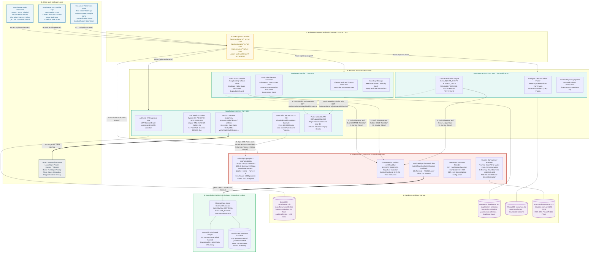

# 🏛️ PharmaChain: Complete End-to-End System Architecture Diagram
### Smart India Hackathon (SIH 2026) | Full Stack Microservices, Cryptography & Blockchain Flow

---

```mermaid
graph TB
%% ══════════════════════════════════════════════════════════════════════════
%% STYLING AND THEME DEFINITION
%% ══════════════════════════════════════════════════════════════════════════
    classDef clientStyle fill:#EBF5FB,stroke:#2980B9,stroke-width:2px,color:#1A5276;
    classDef ingressStyle fill:#FEF9E7,stroke:#F39C12,stroke-width:2px,color:#7D6608;
    classDef serviceStyle fill:#E8F8F5,stroke:#16A085,stroke-width:2px,color:#0E6251;
    classDef coreStyle fill:#FDEDEC,stroke:#C0392B,stroke-width:3px,color:#78281F;
    classDef dbStyle fill:#F4ECF7,stroke:#8E44AD,stroke-width:2px,color:#512E5F;
    classDef ledgerStyle fill:#EAFAF1,stroke:#27AE60,stroke-width:3px,color:#145A32;
    classDef hardwareStyle fill:#EBEDEF,stroke:#5D6D7E,stroke-width:2px,color:#2C3E50;

%% ══════════════════════════════════════════════════════════════════════════
%% LAYER 1: CLIENT APPLICATIONS & PHYSICAL SCANNING DEVICES
%% ══════════════════════════════════════════════════════════════════════════
    subgraph CLIENTS ["1. Client and Hardware Layer"]
        MFR_UI["Manufacturer Web Dashboard<br/>React + Vite + Tailwind<br/>Batch Creation Wizard<br/>Live Mint Progress Polling<br/>QR CSV Download / Recall"]:::clientStyle
        SHOP_UI["Shopkeeper POS Mobile App<br/>React Native / PWA<br/>Camera Barcode Scanner<br/>Intake Bulk Scan<br/>Checkout Sale Scan"]:::clientStyle
        CONS_UI["Consumer Public Scan PWA<br/>Zero-Install Web Page<br/>Native Camera / Google Lens<br/>7 UI Verification States<br/>Incident Report Submission"]:::clientStyle
        PRINTER["Factory Industrial Conveyor<br/>Laser/Inkjet Printers<br/>Domino / Videojet<br/>Blister Foil Strips Primary<br/>Mono-Boxes Secondary<br/>Shipper Cartons Tertiary"]:::hardwareStyle
    end

%% ══════════════════════════════════════════════════════════════════════════
%% LAYER 2: KUBERNETES INGRESS & ROUTING GATEWAY
%% ══════════════════════════════════════════════════════════════════════════
    subgraph INGRESS_LAYER ["2. Kubernetes Ingress and Path Gateway - Port 80 / 443"]
        INGRESS["NGINX Ingress Controller<br/>/api/manufacturer/* to Port 3001<br/>/api/shopkeeper/* to Port 3002<br/>/api/consumer/* to Port 3003<br/>/core/* and /.well-known/* to Port 4000"]:::ingressStyle
    end

    MFR_UI -->|"HTTPS /api/manufacturer/*"| INGRESS
    SHOP_UI -->|"HTTPS /api/shopkeeper/*"| INGRESS
    CONS_UI -->|"HTTPS /api/consumer/*"| INGRESS

%% ══════════════════════════════════════════════════════════════════════════
%% LAYER 3: BACKEND MICROSERVICES
%% ══════════════════════════════════════════════════════════════════════════
    subgraph MICROSERVICES ["3. Backend Microservices Cluster"]

        %% ── MANUFACTURER SERVICE ──────────────────────────────────────────
        subgraph MFR_SERVICE ["manufacturer-service - Port 3001"]
            MFR_AUTH["Auth and KYC Approval Gate<br/>JWT Cookie/Bearer<br/>License and GSTIN Validation"]
            MFR_BATCH["Dual Batch ID Engine<br/>System ID: PC-BATCH-MFR-DATE-HEX<br/>Legacy B.No: AUG-625-AUG26-01<br/>54-Field Rich Schema CDSCO, QA"]
            MFR_WORKER["Async Mint Worker - HTTP 202<br/>Chunked Pack.insertMany 1k/chunk<br/>Up to 100,000 Packs<br/>Live mintedPacksCount Progress"]
            MFR_EXPORT["QR CSV Exporter /export/csv<br/>Streams packs / boxes / cartons<br/>Generates Dual-Mode Verify URLs<br/>verify/:packHash?token=..."]
            MFR_PUBLIC["Public Metadata API<br/>GET /public/:batchId<br/>Strips Internal Notes and Line IDs<br/>Returns Medicine Display Details"]
        end
        MFR_SERVICE:::serviceStyle

        %% ── SHOPKEEPER SERVICE ────────────────────────────────────────────
        subgraph SHOP_SERVICE ["shopkeeper-service - Port 3002"]
            SHOP_AUTH["Chemist Auth and License Verification<br/>Drug License Number Gate"]
            SHOP_INTAKE["Intake Scan Controller<br/>Accepts Verify URL or Token<br/>Duplicate Intake Guard PackEvent<br/>Expiry Date Guard"]
            SHOP_SALE["POS Sale Checkout Controller<br/>Enforces AT_SHOP State Check<br/>Prevents Front-Running and Clones<br/>Decrements Stock"]
            SHOP_INV["Inventory Manager<br/>Real-Time Stock Counts by Batch<br/>Expiry and Low-Stock Alerts"]
        end
        SHOP_SERVICE:::serviceStyle

        %% ── CONSUMER SERVICE ──────────────────────────────────────────────
        subgraph CONS_SERVICE ["consumer-service - Port 3003 - The Public MVP"]
            CONS_PARSER["Intelligent URL and Token Parser<br/>Extracts packHash from Path Param<br/>Extracts token from Query Param"]
            CONS_VERIFY["7-State Verification Engine<br/>GENUINE / AT_SHOP / ALREADY_SOLD<br/>RECALLED / EXPIRED / COUNTERFEIT<br/>NOT_FOUND"]
            CONS_REPORT["Incident Reporting Pipeline<br/>Scanned Token + Geolocation<br/>Timestamp to Regulatory Log"]
        end
        CONS_SERVICE:::serviceStyle

    end

    INGRESS -->|"Route /api/manufacturer/*"| MFR_SERVICE
    INGRESS -->|"Route /api/shopkeeper/*"| SHOP_SERVICE
    INGRESS -->|"Route /api/consumer/*"| CONS_SERVICE

%% ══════════════════════════════════════════════════════════════════════════
%% LAYER 4: CRYPTOGRAPHIC TRUST ROOT (PHARMA-CORE)
%% ══════════════════════════════════════════════════════════════════════════
    subgraph CORE_ENGINE ["4. pharma-core - Port 4000 - Central Trust Root"]
        CORE_MINT["Bulk Signing Engine - mintPacksBatch<br/>1 scrypt Decrypt ~150ms + 100k In-Memory EC Signs<br/>Quadruple Entropy: batchId + serial + nonce + ts<br/>Benchmark: 5,000 packs in 518ms ~0.104ms/pack"]
        CORE_VERIFY["Cryptographic Verifier - verifyPackJwt<br/>ECDSA P-256 ES256 Signature Validation<br/>Expiry Check and SHA-256 Hash Derivation"]
        CORE_KEYSTORE["Keystore Concurrency Manager<br/>Promise-Chain Write Mutex - Zero JSON Corruption<br/>In-Memory Read Cache 1k reads to 1 read<br/>AES-256-GCM Master Secret Encryption"]
        CORE_JWKS["JWKS and Discovery Provider<br/>GET /.well-known/jwks.json Combined EC + RSA<br/>GET /.well-known/openid-configuration"]
        CORE_FABRIC_CLIENT["Fabric Bridge - backendClient<br/>submitTransitionBatchChunked 250/block<br/>60s Timeout + RS256 Bearer Token Per Request"]
    end
    CORE_ENGINE:::coreStyle

    INGRESS -->|"Route /core/* and /.well-known/*"| CORE_ENGINE

    %% M2M Internal Security Connections
    MFR_WORKER -->|"1. Sign 100k Packs and Submit MINTED Transitions<br/>[X-Service-Token + RS256 Bearer]"| CORE_MINT
    SHOP_INTAKE -->|"2. Verify Signature and Submit INTAKE Transition<br/>[X-Service-Token]"| CORE_VERIFY
    SHOP_SALE -->|"3. Verify Signature and Submit SOLD Transition<br/>[X-Service-Token]"| CORE_VERIFY
    CONS_VERIFY -->|"4. Verify Signature and Read Ledger State<br/>[X-Service-Token]"| CORE_VERIFY

    %% Direct Cross-Service Metadata Lookup
    CONS_VERIFY -.->|"5. Fetch Medicine Display Info<br/>GET /api/manufacturer/batch/public/:batchId"| MFR_PUBLIC
    SHOP_INTAKE -.->|"Fetch Medicine Display Info<br/>GET /api/manufacturer/batch/public/:batchId"| MFR_PUBLIC

%% ══════════════════════════════════════════════════════════════════════════
%% LAYER 5: PERSISTENCE & KEY STORAGE
%% ══════════════════════════════════════════════════════════════════════════
    subgraph STORAGE_LAYER ["5. Databases and Key Storage"]
        MFR_DB[("MongoDB: manufacturer_db<br/>manufacturers collection<br/>batches collection - 54 fields<br/>packs collection - 100k items")]:::dbStyle
        SHOP_DB[("MongoDB: shopkeeper_db<br/>shopkeepers collection<br/>inventories collection<br/>packevents collection - Duplicate Guard")]:::dbStyle
        CONS_DB[("MongoDB: consumer_db<br/>reports collection - Counterfeit Incidents")]:::dbStyle
        KEYSTORE_FILE[("Encrypted Keystore on PV<br/>keystore.json AES-256-GCM<br/>RSA-4096 Private/Public PEMs")]:::dbStyle
    end

    MFR_SERVICE --- MFR_DB
    SHOP_SERVICE --- SHOP_DB
    CONS_SERVICE --- CONS_DB
    CORE_KEYSTORE --- KEYSTORE_FILE

%% ══════════════════════════════════════════════════════════════════════════
%% LAYER 6: BLOCKCHAIN & CONSORTIUM LEDGER
%% ══════════════════════════════════════════════════════════════════════════
    subgraph LEDGER_LAYER ["6. Hyperledger Fabric Permissioned Consortium Ledger"]
        CHAINCODE["PharmaChain Smart Contract Chaincode<br/>State Machine: MINTED to INTAKE/AT_SHOP to SOLD to RECALLED"]
        FABRIC_BLOCKS["Immutable Distributed Ledger<br/>250 Transitions per Block Commit<br/>Cryptographic Hash Chain of Custody"]
        COUCH_DB[("World State Database CouchDB<br/>Key: packHash:MFG / packHash:SHOP<br/>Value: currentOwner, status, timestamp")]
    end
    LEDGER_LAYER:::ledgerStyle

    CORE_FABRIC_CLIENT ==>|"gRPC / REST Blockchain Commits"| CHAINCODE
    CHAINCODE --- FABRIC_BLOCKS
    CHAINCODE --- COUCH_DB

%% ══════════════════════════════════════════════════════════════════════════
%% FACTORY PRINTER PIPELINE
%% ══════════════════════════════════════════════════════════════════════════
    MFR_EXPORT ==>|"CSV of QR URLs and Hashes"| PRINTER
```
