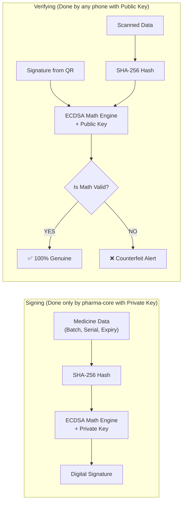
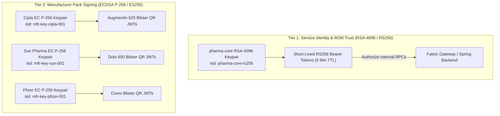
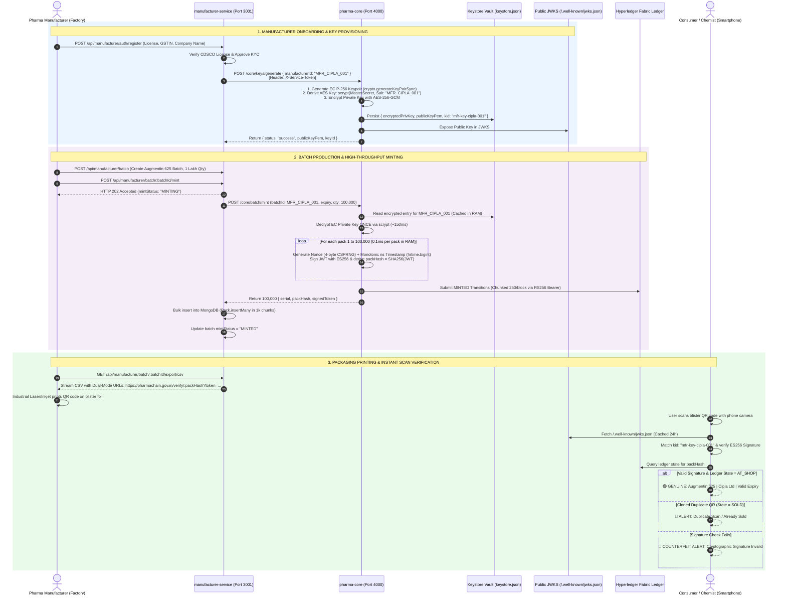
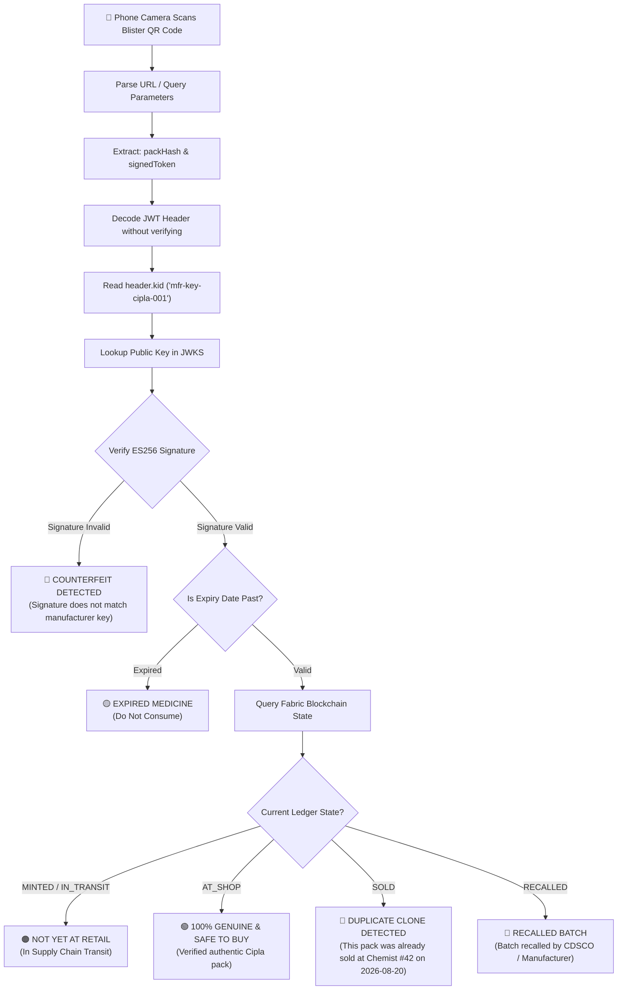

# 🔐 PharmaChain: Cryptographic Key Architecture & Trust Engine Guide
### A Comprehensive, Beginner-to-Advanced Technical Masterclass
### Smart India Hackathon (SIH 2026) | National Drug Track-and-Trace Platform

---

## 📖 Table of Contents
1. [Executive Overview: The Problem We Are Solving](#1-executive-overview-the-problem-we-are-solving)
2. [Foundational Cryptography: Jargon Demystified from Scratch](#2-foundational-cryptography-jargon-demystified-from-scratch)
3. [The Two-Tier Key Hierarchy in PharmaChain](#3-the-two-tier-key-hierarchy-in-pharmachain)
4. [Master Cryptographic Architecture Diagram](#4-master-cryptographic-architecture-diagram)
5. [Deep Dive Phase 1: Manufacturer Onboarding & Isolated Key Provisioning](#5-deep-dive-phase-1-manufacturer-onboarding--isolated-key-provisioning)
6. [Deep Dive Phase 2: High-Throughput Batch Minting (1 Lakh Packs in Seconds)](#6-deep-dive-phase-2-high-throughput-batch-minting-1-lakh-packs-in-seconds)
7. [Deep Dive Phase 3: Public Discovery & The JWKS Engine](#7-deep-dive-phase-3-public-discovery--the-jwks-engine)
8. [Deep Dive Phase 4: Verification & Anti-Counterfeit Enforcement](#8-deep-dive-phase-4-verification--anti-counterfeit-enforcement)
9. [Threat Model & Security Matrix: How Attacks Are Defeated](#9-threat-model--security-matrix-how-attacks-are-defeated)
10. [Codebase Reference & Cheat Sheet](#10-codebase-reference--cheat-sheet)

---

## 1. Executive Overview: The Problem We Are Solving

According to the World Health Organization (WHO), over **10% of medicines in low- and middle-income countries are counterfeit or substandard**, resulting in hundreds of thousands of preventable deaths annually.

### Traditional Serial Numbers Fail Because:
1. **Predictability**: Incremental serial numbers (e.g. `BATCH-001-0001`, `BATCH-001-0002`) can easily be guessed by counterfeiters.
2. **No Mathematical Proof of Origin**: Anyone with a barcode printer can print a label saying *"Manufactured by Cipla"*. The scanner has no way to verify if Cipla actually authorized that label.
3. **Cloning (The Xerox Problem)**: A counterfeiter buys **one real medicine box**, scans its genuine QR code, prints **10,000 exact copies**, and pastes them on 10,000 chalk-filled fake boxes.

### How PharmaChain Solves This with Cryptography + Blockchain:
PharmaChain establishes **`pharma-core` (Port 4000)** as a National Cryptographic Trust Authority:
- Every approved pharma manufacturer is given a **unique, mathematically unforgeable ECDSA cryptographic keypair**.
- Every single blister pack is individually stamped with a **digitally signed JSON Web Token (JWT)** that contains high-resolution entropy (a unique serial, a random nonce, and nanosecond timestamp).
- When scanned, the signature is mathematically validated using the manufacturer's **Public Key** hosted on a global **JWKS (JSON Web Key Set)** endpoint.
- The custody state is tracked on **Hyperledger Fabric**, ensuring that if a cloned QR is scanned twice, it is instantly flagged as **`ALREADY_SOLD / DUPLICATE CLONE`**.

---

## 2. Foundational Cryptography: Jargon Demystified from Scratch

If you are a new developer or new to cybersecurity, cryptographic terms can seem intimidating. Let's break down every single concept with clear real-world analogies.

---

### 2.1 Symmetric vs. Asymmetric Cryptography

```
┌─────────────────────────────────────────────────────────────────────────────┐
│ 1. SYMMETRIC ENCRYPTION (One Secret Key for Both Lock & Unlock)             │
│                                                                             │
│   Plaintext Data ───► [🔒 Lock with Secret Key 'K'] ───► Ciphertext Data     │
│   Ciphertext Data ──► [🔓 Unlock with SAME Key 'K'] ───► Plaintext Data     │
│                                                                             │
│   Analogy: A physical safe box with one single key. Anyone who has the key  │
│   can lock it and unlock it. (Example: AES-256-GCM)                         │
└─────────────────────────────────────────────────────────────────────────────┘

┌─────────────────────────────────────────────────────────────────────────────┐
│ 2. ASYMMETRIC CRYPTOGRAPHY (A Keypair: One Private, One Public)             │
│                                                                             │
│   Private Key (Secret) ──► Used to SIGN (Create an unforgeable stamp)       │
│   Public Key  (Open)   ──► Used to VERIFY (Anyone can check the stamp)      │
│                                                                             │
│   Analogy: A post office collection mailbox. Anyone can drop a letter in   │
│   (Public), but only the postman with the secret master key can open and   │
│   sign for the mail bag (Private). (Example: ECDSA P-256, RSA-4096)         │
└─────────────────────────────────────────────────────────────────────────────┘
```

- **Symmetric Cryptography**: Fast, efficient. Used in PharmaChain to **encrypt the Keystore vault at rest on disk** using AES-256-GCM.
- **Asymmetric Cryptography**: Mathematically pairs two keys. Used in PharmaChain for **digital signatures on medicine packs** so the entire world can verify authenticity without needing the secret signing key.

---

### 2.2 Elliptic Curve Cryptography (ECC) & ECDSA (ES256)

**ECDSA** stands for *Elliptic Curve Digital Signature Algorithm*.
- Instead of using massive prime numbers like older RSA algorithms, ECC relies on the algebraic properties of elliptic curves over finite fields:
  $$y^2 = x^3 + ax + b \pmod p$$
- We specifically use the **NIST P-256 curve (also known as `prime256v1` / `secp256r1`)**.
- **Why ECC over RSA for Medicine QR Codes?**
  - An RSA-4096 signature is very long (over 512 bytes). A QR code with that much data would be huge, dense, and very hard for budget smartphone cameras to scan on a tiny pill blister.
  - An **ECDSA P-256 signature** provides military-grade 128-bit security equivalent to RSA-3072, but produces a tiny, compact signature (~64 bytes). This creates **clean, high-contrast, easily scannable QR codes**.

---

### 2.3 What Does "Digital Signing" vs. "Verification" Mean?



1. **Signing**:
   `pharma-core` takes medicine data, hashes it, and encrypts that hash with the manufacturer's **Private Key**. This produces a mathematical string called a **Digital Signature**.
2. **Verification**:
   When a phone scans the QR code, it uses the manufacturer's **Public Key** to verify the signature. If even a single character (e.g. expiry date or serial number) was altered, the mathematical equation breaks and the signature fails instantly.

---

### 2.4 Hash Functions (SHA-256)

A cryptographic hash function takes any input of any size and turns it into a fixed **64-character hexadecimal string** (256 bits).
- **One-Way (Pre-image Resistance)**: Easy to compute $H = \text{SHA256}(M)$, but mathematically impossible to reverse $H \to M$.
- **Avalanche Effect**: Changing 1 bit in the input completely randomizes the entire output hash.
- **In PharmaChain**: We compute `packHash = SHA256(rawSignedJWT)`. This 64-character hex string acts as the **global primary key** for each physical pack across MongoDB, REST URLs, and Hyperledger Fabric.

---

### 2.5 Salt & Key Derivation Functions (`scrypt`)

- Storing encryption keys in plain memory derived from simple passwords is weak against brute-force hardware (GPUs/ASICs).
- **`scrypt`** is a **memory-hard Key Derivation Function (KDF)** designed specifically to make hardware brute-force attacks computationally expensive and unfeasible.
- **Salt**: A random or distinct string mixed into the password before hashing so identical passwords don't produce identical keys.
- **In PharmaChain**: When encrypting a manufacturer's private key, `pharma-core` uses `scrypt(masterSecret, manufacturerId)`. Because `manufacturerId` is the salt, **every manufacturer's key is encrypted with a completely isolated AES key**.

---

### 2.6 Authenticated Symmetric Encryption (AES-256-GCM)

**AES-256-GCM** stands for *Advanced Encryption Standard (256-bit key) in Galois/Counter Mode*.
- Unlike older encryption modes (like AES-CBC), GCM is an **Authenticated Encryption with Associated Data (AEAD)** cipher.
- It produces three components:
  1. **IV (Initialization Vector - 16 bytes)**: A random nonce ensuring that encrypting the same private key twice produces completely different ciphertexts.
  2. **Ciphertext**: The encrypted private key data.
  3. **Auth Tag (Authentication Tag - 16 bytes)**: A cryptographic checksum. If anyone tampers with even one bit of the encrypted file on disk, AES-GCM fails decryption immediately.
- Stored format in `keystore.json`: `ivHex : authTagHex : cipherHex`.

---

### 2.7 JSON Web Tokens (JWT) & `kid`

A **JWT** is an open standard (RFC 7519) that represents claims securely between two parties. It consists of three parts separated by dots (`.`):
$$\underbrace{\text{eyJhbGciOi...}}_{\text{Header}} \ . \ \underbrace{\text{eyJzdWIiOi...}}_{\text{Payload}} \ . \ \underbrace{\text{kQ2M8Z...}}_{\text{Signature}}$$

```json
// 1. HEADER: Metadata about algorithm and which key signed it
{
  "alg": "ES256",
  "typ": "JWT",
  "kid": "mfr-key-cipla-001"  <-- KEY ID (Points to the exact public key in JWKS)
}

// 2. PAYLOAD: The Medicine Pack Claims
{
  "batchId": "PC-BATCH-CIPLA0-20260822-7D3A1F",
  "serial": "00001",
  "expiryDate": "2028-08-31",
  "manufacturerId": "MFR_CIPLA_001",
  "nonce": "a3f7b2c1",
  "ts": "1787406879519847293"
}

// 3. SIGNATURE: Cryptographic proof made with the manufacturer's EC Private Key
ES256( Base64Url(Header) + "." + Base64Url(Payload), PrivateKey )
```

---

### 2.8 JWKS (JSON Web Key Set) & OIDC Discovery

A **JWKS** (RFC 7517) is a JSON document hosted at `/.well-known/jwks.json` that publishes an array of **Public Keys** in standard format.
- Instead of consumers or mobile apps having to hardcode public keys or download certificates manually, they fetch `https://pharmachain.gov.in/.well-known/jwks.json`.
- When a phone scans a pack, it reads the `kid` (e.g. `mfr-key-cipla-001`) from the QR header, finds the matching key in the JWKS, and verifies the signature instantly.

---

## 3. The Two-Tier Key Hierarchy in PharmaChain

PharmaChain separates keys into two distinct tiers for maximum security isolation:



| Dimension | Tier 1: Core Service Key | Tier 2: Manufacturer Keys |
| :--- | :--- | :--- |
| **Algorithm** | **RSA-4096 (RS256)** | **ECDSA P-256 (ES256 / `prime256v1`)** |
| **Owner** | `pharma-core` platform authority | Individual verified pharmaceutical manufacturer |
| **Purpose** | Machine-to-Machine service auth (pharma-core $\to$ Fabric backend) | Digital signing of physical blister pack QR codes |
| **Key Count** | 1 central system keypair | $N$ unique keypairs (1 per approved manufacturer) |
| **Storage Location** | `config/rsa/pharma-core-{private,public}.pem` | `data/keystore.json` (AES-256-GCM encrypted) |
| **Token Lifetime** | 5 minutes (Ephemeral M2M Bearer) | 2 to 5 years (Matches physical medicine shelf life) |

---

## 4. Master Cryptographic Architecture Diagram

Here is the complete end-to-end blueprint showing how keys are generated, encrypted, stored, used for bulk minting, published via JWKS, and verified at the consumer's smartphone camera.



---

## 5. Deep Dive Phase 1: Manufacturer Onboarding & Isolated Key Provisioning

When a new manufacturer registers and is approved, `pharma-core` provisions their cryptographic identity.

### 5.1 Step-by-Step Code Walkthrough

```javascript
// File: services/pharma-core/services/crypto.service.js

export const generateManufacturerKey = async (manufacturerId) => {
    const masterSecret = process.env.KEY_ENCRYPTION_SECRET;
    if (!masterSecret) throw new Error('KEY_ENCRYPTION_SECRET is not configured');

    // ── Step 1: Generate Asymmetric EC P-256 Keypair ──────────────────────────
    // Creates a mathematically linked Private Key (secret) and Public Key (open)
    const { privateKey, publicKey } = crypto.generateKeyPairSync('ec', {
        namedCurve: 'prime256v1', // NIST P-256 / secp256r1
        publicKeyEncoding:  { type: 'spki',  format: 'pem' },
        privateKeyEncoding: { type: 'pkcs8', format: 'pem' },
    });

    // ── Step 2: Derive an Isolated AES Key using scrypt KDF ───────────────────
    // manufacturerId acts as the SALT. Even if two servers had the same master secret,
    // Cipla's AES key is completely different from Sun Pharma's AES key.
    const derivedKey = await deriveKey(masterSecret, manufacturerId);

    // ── Step 3: Encrypt the Private Key with AES-256-GCM ─────────────────────
    const iv     = crypto.randomBytes(16); // 16-byte random IV
    const cipher = crypto.createCipheriv('aes-256-gcm', derivedKey, iv);

    const encrypted = Buffer.concat([cipher.update(privateKey, 'utf-8'), cipher.final()]);
    const authTag   = cipher.getAuthTag(); // 16-byte integrity check tag

    // Pack into formatted string: ivHex:authTagHex:cipherHex
    const encryptedPrivKey = [
        iv.toString('hex'),
        authTag.toString('hex'),
        encrypted.toString('hex'),
    ].join(':');

    const keyId = `mfr-key-${manufacturerId.toLowerCase().replace(/[^a-z0-9]/g, '-')}`;

    // ── Step 4: Persist to Atomic Keystore Vault ─────────────────────────────
    const keystore = await readKeystore();
    keystore[manufacturerId] = {
        encryptedPrivKey,
        publicKeyPem: publicKey,
        algorithm: 'ES256',
        keyId,
        createdAt: new Date().toISOString(),
    };
    await writeKeystore(keystore);

    return { publicKeyPem: publicKey, keyId };
};
```

### 5.2 Key Points in This Phase:
1. **Idempotency Guard**: [`keys.controller.js:L33-L44`](file:///Users/home/Desktop/SIH_2026/services/pharma-core/controllers/keys.controller.js#L33-L44) checks if the manufacturer already has an active key in `keystore.json`. If a key already exists, it returns `409 Conflict`. Overwriting an active key would invalidate all existing medicines already circulating in the market!
2. **Write Mutex Protection**: [`keystore.js:L20-L26`](file:///Users/home/Desktop/SIH_2026/services/pharma-core/config/keystore.js#L20-L26) wraps `writeKeystore` inside an in-process Promise-chain mutex so simultaneous onboarding requests never corrupt the JSON file.

---

## 6. Deep Dive Phase 2: High-Throughput Batch Minting (1 Lakh Packs in Seconds)

In real-world pharmaceutical manufacturing, an industrial factory line packaging blister packs produces **10,000 to 100,000 packs per batch**.

### 6.1 The Engineering Bottleneck & Our Solution

| Approach | Architecture | 1 Lakh Packs Time | Feasibility |
| :--- | :--- | :--- | :--- |
| **Naive Approach** | Read disk + Decrypt private key with scrypt on **every single pack** ($100,000 \times 150\text{ms}$) | **~4.1 Hours** | ❌ Completely unusable for real factory conveyor belts |
| **PharmaChain Optimized Engine** | Decrypt key into RAM **once** ($150\text{ms}$) $\to$ Sign all $100,000$ JWTs in memory loop ($0.1\text{ms/pack}$) | **~10.5 Seconds** | ✅ Factory Ready (~10,000 packs/sec) |

### 6.2 The Quadruple Entropy Formula

To ensure zero hash collisions and guarantee absolute uniqueness even across billions of packs worldwide, every pack JWT payload embeds four layers of entropy:

$$\text{Pack Payload} = \{ \underbrace{\text{batchId}}_{\text{Batch Scope}}, \ \underbrace{\text{serial}}_{\text{Sequential Index}}, \ \underbrace{\text{nonce}}_{\text{4-Byte CSPRNG}}, \ \underbrace{\text{ts}}_{\text{Nanosecond Clock}} \}$$

```javascript
// File: services/pharma-core/services/crypto.service.js

for (let i = 1; i <= quantity; i++) {
    const serial = String(i).padStart(5, '0'); // "00001" ... "100000"
    
    // Entropy 1: 4 cryptographically random bytes (8 hex characters)
    // Generated by Node.js CSPRNG (/dev/urandom) -> Collision probability: 1 in 4.3 Billion
    const nonce = crypto.randomBytes(4).toString('hex');
    
    // Entropy 2: Monotonic nanosecond clock (process.hrtime.bigint)
    // Never repeats, guarantees distinct timestamps even in the same CPU clock cycle
    const ts = process.hrtime.bigint().toString();

    const payload = { batchId, serial, expiryDate, manufacturerId, nonce, ts };

    // Synchronous in-memory ECDSA sign (pure math in C++ via OpenSSL bindings)
    const signedToken = jwt.sign(payload, privateKeyPem, {
        algorithm: 'ES256',
        keyid:     entry.keyId,
    });

    // Primary Key: SHA256 of the raw JWT string
    const packHash = crypto.createHash('sha256').update(signedToken).digest('hex');

    packs.push({ serial, packHash, signedToken });
}
```

---

## 7. Deep Dive Phase 3: Public Discovery & The JWKS Engine

To allow any scanner, pharmacy POS terminal, or government auditor to verify QR codes without needing special login credentials or API keys, `pharma-core` acts as an **OpenID Connect (OIDC) Discovery Provider**.

### 7.1 How JWKS Works

When a client hits `GET /.well-known/jwks.json`, [`jwks.controller.js`](file:///Users/home/Desktop/SIH_2026/services/pharma-core/controllers/jwks.controller.js) dynamically constructs the JWKS:

```json
{
  "keys": [
    {
      "kty": "EC",
      "crv": "P-256",
      "kid": "mfr-key-cipla-001",
      "use": "sig",
      "alg": "ES256",
      "x": "LR34xhomGoYLs6gbLlP3wJk1yoKPyUoyyWIfs5RLREc",
      "y": "mc4GyWyn3gJKShHUNVsKMB9KxRCscb5ImTzyAZ9cwAg"
    },
    {
      "kty": "RSA",
      "kid": "pharma-core-rs256",
      "use": "sig",
      "alg": "RS256",
      "n": "u1g8Z2... (RSA 4096-bit Modulus)",
      "e": "AQAB"
    }
  ]
}
```

- **`x` and `y`**: The exact affine $(x, y)$ coordinates on the elliptic curve representing Cipla's public key.
- **Cache-Control: `public, max-age=86400`**: Allows CDN edge caches, mobile apps, and Spring Security resource servers to cache the public keys for **24 hours**. This ensures verifying a scan takes **0 network requests to `pharma-core`**, scaling to millions of scans per second nationwide.

---

## 8. Deep Dive Phase 4: Verification & Anti-Counterfeit Enforcement



### The 7 UI Verification States:
1. **`GENUINE (AT_SHOP)`**: Signature valid, unexpired, currently in retail inventory ready for purchase.
2. **`GENUINE (IN_TRANSIT)`**: Signature valid, moving from factory to distributor.
3. **`ALREADY_SOLD (CLONED QR)`**: Signature valid, but state is `SOLD`. Alerts the consumer that a counterfeiter photocopied a real box.
4. **`RECALLED`**: Manufacturer issued a safety recall. Instantly locks all packs in that batch nationwide.
5. **`EXPIRED`**: Signature valid, but current date > `expiryDate`.
6. **`COUNTERFEIT (INVALID_SIGNATURE)`**: The QR data was forged or modified; mathematical signature verification failed.
7. **`NOT_FOUND`**: Hash not present on the National Blockchain ledger.

---

## 9. Threat Model & Security Matrix: How Attacks Are Defeated

| # | Attack Scenario | How Attacker Attempts It | Why PharmaChain Architecture Defeats It |
| :---: | :--- | :--- | :--- |
| **1** | **Fake QR Generation** | Counterfeiter creates their own QR codes with fake batch info. | **Fails at Step 1 (JWKS Verification)**: The counterfeiter does not have Cipla's private key. The signature verification fails mathematically with `INVALID_SIGNATURE`. |
| **2** | **QR Cloning (Photocopy Attack)** | Counterfeiter buys 1 genuine pack and prints 10,000 copies of its QR onto fake packs. | **Fails at Step 2 (Hyperledger Fabric World State)**: When the 1st pack is sold, the ledger flips state to `SOLD`. The remaining 9,999 fake packs will instantly trigger `ALREADY_SOLD / DUPLICATE_CLONE` on scan. |
| **3** | **Factory Server Compromise** | Rogue employee tries to steal private keys from the manufacturing plant. | **Zero Local Keys**: Factory computers and `manufacturer-service` never store or touch private keys. Private keys exist only encrypted inside `pharma-core`'s vault. |
| **4** | **Database Theft of Keystore** | Hacker steals `data/keystore.json` from the server disk. | **AES-256-GCM + scrypt**: The private keys are encrypted with 256-bit AES. Breaking `scrypt` memory-hard derivation without `KEY_ENCRYPTION_SECRET` is computationally unfeasible. |
| **5** | **Identity Impersonation** | Manufacturer B tries to sign a batch claiming to be Manufacturer A. | **Domain & Key Isolation**: `pharma-core` checks caller credentials and signs only using the key matching the authenticated `manufacturerId`. |
| **6** | **Race Condition / Key Corruption** | Multiple manufacturers register simultaneously under heavy load. | **Promise Write Mutex**: [`withWriteLock`](file:///Users/home/Desktop/SIH_2026/services/pharma-core/config/keystore.js#L20-L26) serializes all disk writes, preventing race conditions or JSON corruption. |

---

## 10. Codebase Reference & Cheat Sheet

### Key Files in the Repository:

```
SIH_2026/
├── services/
│   ├── pharma-core/                      # PORT 4000: The Trust Root
│   │   ├── config/
│   │   │   ├── keys.js                  # RSA-4096 identity key manager
│   │   │   ├── keystore.js              # AES-256-GCM vault with Write Mutex & Cache
│   │   │   └── rsa/                     # RSA PEM files for service identity
│   │   ├── services/
│   │   │   ├── crypto.service.js        # EC P-256 Keygen, 100k Bulk Minting, JWKS builder
│   │   │   └── backendClient.service.js # Fabric Gateway client with RS256 Bearer auth
│   │   ├── controllers/
│   │   │   ├── keys.controller.js       # Key provisioning & public key lookup
│   │   │   ├── batch.controller.js      # /core/batch/mint orchestrator
│   │   │   ├── hash.controller.js       # ES256 QR verification & ledger status
│   │   │   ├── chain.controller.js      # INTAKE, SALE, RECALL transitions
│   │   │   └── jwks.controller.js       # /.well-known/jwks.json provider
│   │   └── data/
│   │       └── keystore.json            # Encrypted vault file
│   │
│   └── manufacturer/                     # PORT 3001: Factory Portal & Batch Engine
│       ├── models/
│       │   ├── batch.model.js           # Dual Batch ID (System ID + Legacy B.No) & 30+ fields
│       │   ├── pack.model.js            # packHash, serialNumber, signedToken
│       │   └── manufacturer.model.js    # KYC status, CDSCO License, Company Profile
│       ├── controllers/
│       │   ├── auth.controller.js       # Registration with KYC gate & JWT login
│       │   └── batch.controller.js      # HTTP 202 Async Mint Worker & 3-Tier CSV Exporter
│       └── services/
│           └── coreClient.service.js    # Talks to pharma-core over internal network
```

---

### 💡 Quick Summary for Viva / Demo:
> *"In PharmaChain, trust is rooted in mathematics, not paper. `pharma-core` provisions an isolated ECDSA P-256 keypair for every verified manufacturer. When batches are produced, `pharma-core` signs up to 100,000 blister packs in seconds using an optimized in-memory cryptographic loop, embedding serials, nonces, and nanosecond timestamps. Every citizen can verify authenticity instantly on their phone via our public JWKS endpoint, while Hyperledger Fabric immutably tracks custody to eliminate QR cloning."*
