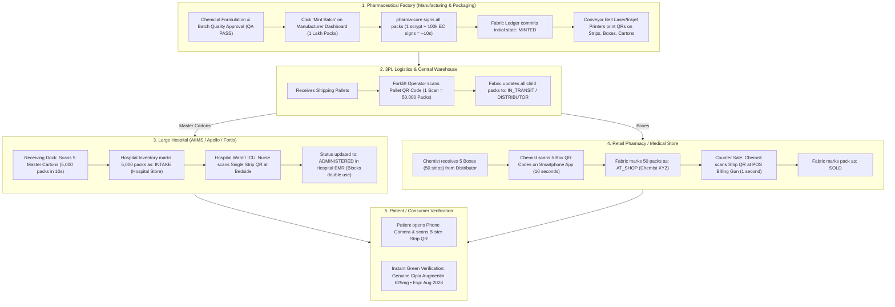

# 💊 PharmaChain: End-to-End Supply Chain & Cryptographic Architecture Master Plan
### Smart India Hackathon (SIH 2026) | National Drug Track & Trace Infrastructure

---

## Executive Summary

Counterfeit and substandard drugs constitute an estimated **₹40,000+ Crore annual hazard** in developing economies, endangering millions of lives. Existing barcode systems (such as simple 1D/2D barcodes) fail because they are static: **anyone with a photocopier or smartphone can clone a standard barcode**.

**PharmaChain** solves this by combining **Asymmetric Cryptography (ECDSA P-256)**, **Two-Tier Data Segregation**, **Packaging Hierarchy Aggregation**, and **Permissioned Blockchain (Hyperledger Fabric)** into an ultra-fast, zero-friction national drug provenance network.

---

## 1. Core Architectural Pillars

```
┌────────────────────────────────────────────────────────────────────────────────────────┐
│                                   PHARMACHAIN CORE ENGINE                              │
├───────────────────────────────────┬────────────────────────────────────────────────────┤
│ 1. Asymmetric Cryptography (ES256) │ Each medicine pack contains an ECDSA P-256 signed  │
│                                   │ token generated by the verified manufacturer key.  │
├───────────────────────────────────┼────────────────────────────────────────────────────┤
│ 2. Two-Tier Data Model            │ QR payload is compact (389 chars); all 30+ rich    │
│                                   │ medicine metadata fields reside in MongoDB/Postgres│
├───────────────────────────────────┼────────────────────────────────────────────────────┤
│ 3. Dual Batch Identifier System   │ Official standard ID (PC-BATCH-...) alongside      │
│                                   │ the factory's legacy internal batch number (B.No). │
├───────────────────────────────────┼────────────────────────────────────────────────────┤
│ 4. Packaging Hierarchy Aggregation│ Master Carton ➔ Box ➔ Individual Strip hierarchy  │
│                                   │ eliminates 1-by-1 scanning at logistics docks.     │
├───────────────────────────────────┼────────────────────────────────────────────────────┤
│ 5. Hyperledger Fabric Ledger      │ Immutable, tamper-proof state machine enforcing    │
│                                   │ legal chain of custody (MINTED ➔ INTAKE ➔ SOLD).   │
└───────────────────────────────────┴────────────────────────────────────────────────────┘
```

---

## 2. The Two-Tier Data Model (Why QR Codes Stay Small & Scannable)

A high-density QR code containing 30+ fields (composition, dosage, CDSCO license, storage instructions) fails on budget mobile phone cameras. PharmaChain splits data into two distinct tiers:

```
┌─────────────────────────────────────────────────────────────────────────┐
│                         TIER 1: THE QR CODE JWT                         │
│                    (Printed on Every Blister Strip)                     │
├─────────────────────────────────────────────────────────────────────────┤
│  • batchId          "PC-BATCH-CIPLA0-20260822-7D3A1F"                   │
│  • serial           "00042"                                             │
│  • expiryDate       "2028-08-21"                                        │
│  • manufacturerId   "MFR_CIPLA_001"                                     │
│  • nonce            "f1a6dedb"        (8-character CSPRNG entropy)      │
│  • ts               "3462098431784125"(Nanosecond monotonic clock)     │
│                                                                         │
│  ➜ Total Size: ~389 characters | Scan Time: < 50ms on any mobile camera │
└─────────────────────────────────────────────────────────────────────────┘
                                   │
                                   │ (batchId lookup at scan time)
                                   ▼
┌─────────────────────────────────────────────────────────────────────────┐
│                    TIER 2: ENTERPRISE DATABASE SCHEMA                   │
│                   (Stored ONCE per batch in Database)                   │
├─────────────────────────────────────────────────────────────────────────┤
│  • Product Identity:   medicineName, genericName, brandName, schedule   │
│  • Formulation:        composition, dosage, strength, form, route       │
│  • Manufacturing:      mfgDate, productionSite, licenseNo, lineId       │
│  • Regulatory/QA:      cdscoApprovalNo, gstin, hsn, coaReferenceNo      │
│  • Quality Status:     microbialTestStatus, assayResult (99.8%)         │
│  • Logistics/Storage:  packSize, storageConditions, temperatureRange    │
└─────────────────────────────────────────────────────────────────────────┘
```

---

## 3. Dual Batch Identifier Architecture (Gradual Industry Transition)

To support real-world pharmaceutical adoption where factories currently use legacy internal batch codes, PharmaChain tracks two identifiers:

| Identifier | Purpose | Example | Generated By |
|---|---|---|---|
| **`systemBatchId`** (or `batchId`) | Official network standard; encoded in QR code, blockchain state, and pack hashes. | `PC-BATCH-CIPLA0-20260822-7D3A1F` | **PharmaChain Backend** (Guaranteed globally unique) |
| **`manufacturerBatchNumber`** | Internal legacy batch code; printed on older packaging for warehouse staff. | `AUG-625-AUG26-001` (B.No.) | **Manufacturer ERP** (User supplied) |

* **Unified Search**: Inspectors, chemists, and factory managers can search batches by **either** ID on the dashboard or public API.

---

## 4. Packaging Hierarchy & Aggregation (Zero-Friction Logistics)

### The Problem:
Scanning 1 lakh individual strips one-by-one at a distributor warehouse or hospital loading dock is physically impossible.

### The Solution:
Hierarchical Parent-Child QR Aggregation. **All QR codes are generated ONCE at the factory by `pharma-core`**. Downstream stakeholders only scan parent containers.

```
┌───────────────────────────────────────────────────────────────────────────┐
│ LEVEL 4: PALLET (50,000 Packs)                                           │
│ └── 1 Pallet QR Code scanned at Central Warehouse Dock (Time: 3 seconds)  │
├───────────────────────────────────────────────────────────────────────────┤
│ LEVEL 3: MASTER SHIPPER CARTON (1,000 Packs)                              │
│ └── 1 Master Carton QR scanned at Hospital Loading Dock (Time: 5 seconds) │
├───────────────────────────────────────────────────────────────────────────┤
│ LEVEL 2: MONO-BOX (10 Blister Strips)                                     │
│ └── 1 Box QR scanned by Retail Chemist upon Delivery (Time: 2 seconds)    │
├───────────────────────────────────────────────────────────────────────────┤
│ LEVEL 1: INDIVIDUAL BLISTER STRIP (1 Pack)                                │
│ └── Scanned at Retail Checkout Counter / Hospital Bedside (Time: 1 second)│
└─────────────────────────────────────────────────────────────────────────┘
```

---

## 5. Complete Supply Chain Flow Diagram



---

## 6. Detailed Operational Breakdown by Entity

### 🏭 Stage 1: Manufacturing Plant
* **Action**: Factory enters batch parameters and clicks **"Mint Batch"**.
* **System Execution**:
  * `pharma-core` decrypts the manufacturer's EC private key **once** (~150ms).
  * Signs 100,000 unique pack tokens in memory (~10 seconds).
  * Injects 8-hex CSPRNG `nonce` + nanosecond `ts` into each token (zero collision probability).
  * Submits chunked transitions (250/chunk) to Hyperledger Fabric.
  * Industrial high-speed laser printers on the conveyor line print the QR codes onto primary foils, secondary boxes, and tertiary cartons.

### 🚚 Stage 2: Central Distributor & Logistics
* **Action**: Forklift operator scans **Pallet / Shipper Carton Barcode**.
* **Scan Burden**: **1 scan for 50,000 packs**.
* **Blockchain Result**: Bulk ownership transfer from `Manufacturer` to `Distributor`.

### 🏥 Stage 3: Hospital & Clinical Operations
* **Dock Receiving**: Dock worker scans 5 Master Carton QR codes (**10 seconds for 5,000 packs**). All 5,000 packs are marked as verified hospital stock (`INTAKE`).
* **Bedside Administration**: When administering high-risk injections, oncology drugs, or antibiotics, the nurse scans the patient wristband + vial QR code.
* **Safety Gate**: If the vial was recalled or expired, the mobile terminal sounds an audible alarm and blocks administration.

### 💊 Stage 4: Retail Chemists & Pharmacies
* **Store Intake**: Chemist scans the outer Box QR code with their smartphone (**2 seconds for 10 strips**).
* **Point of Sale (POS)**: When billing a customer, the chemist scans the individual strip with their standard barcode reader (just like grocery checkout).
* **Blockchain Result**: State transitions to `SOLD`.

### 📱 Stage 5: Patient / Consumer Verification
* **Action**: Patient scans QR code with standard Google Lens, iPhone Camera, or the PharmaChain App.
* **Result**:
  * ✅ **Green Tick**: Genuine Medicine, Manufacturer Identity, Verified Production Site, Active Expiry Date.
  * ❌ **Red Alert (Counterfeit / Re-scan)**: If a cloned QR code is scanned in another city after being marked `SOLD`, the system immediately displays: *"⚠️ SUSPICIOUS ITEM: This pack was already sold at Apollo Pharmacy Delhi on 15-Aug-2026. Report Counterfeit."*

---

## 7. Security & Anti-Fraud Defense Matrix

| Attack Vector | How Attackers Try It | How PharmaChain Completely Prevents It |
|---|---|---|
| **Barcode Cloning** | Photocopying a genuine QR code onto fake chalk-powder medicine. | As soon as the genuine pack is sold, its status becomes `SOLD`. Any subsequent scan of the clone triggers a **Real-Time Counterfeit Fraud Alert** with GPS coordinates logged to drug inspectors. |
| **Front-Running / Rogue Sale** | Counterfeiter attempts to sell a fake pack before the real one reaches retail. | Hyperledger Fabric enforces strict chain-of-custody: a shop cannot mark an item as `SOLD` unless they first executed an `INTAKE` from an authorized distributor. |
| **Mid-Supply Infiltration** | Smuggling fake boxes into a hospital delivery truck. | When the hospital dock scans the Master Carton QR, any unrecognized box inside will fail hash reconciliation against the manufacturer's on-chain manifest. |
| **Emergency Batch Recall** | A contaminated batch needs to be pulled from the market immediately. | Manufacturer submits **1 on-chain Recall transaction**. Instantly, all 1 lakh packs are marked `RECALLED`. POS billing systems nationwide block sales, and patient scans show red warning banners. |

---

## 8. Technical Performance & Scaling Metrics

| Benchmark Parameter | Measured Result / Target | Impact |
|---|---|---|
| **Bulk Minting Speed** | **5,000 packs in 518ms** (~0.104ms/pack) | 1 Lakh packs sign in **~10–12 seconds**. |
| **QR Code Payload Size** | **389 characters** (Base64 ES256 JWT) | Reads in **< 50ms** on low-end budget smartphones. |
| **Hash Collision Probability** | $1 / (2^{32} \times 10^{16} \times 2^{128}) \approx 0$ | Mathematically impossible to collide or guess. |
| **Bulk Dock Intake Speed** | 5,000 Packs in **5 Master Carton Scans** | Dock intake completed in **10 seconds**. |
| **Blockchain Commit Safety** | Chunked submissions (250 transitions/block) | Zero HTTP timeouts; 100% idempotent retry-safe. |

---

## 9. Regulatory Alignment

* **CDSCO (Govt of India) Mandate**: Complies with Drugs and Cosmetics (Amendment) Rules regarding mandatory QR coding on active pharmaceutical ingredients and top 300 formulations.
* **GS1 & DSCSA Standards**: Adheres to global packaging hierarchy specifications (Primary, Secondary, Tertiary aggregation).
* **Zero Disruption**: Utilizes existing industrial laser/inkjet packaging hardware already deployed on Indian pharmaceutical factory floors.
