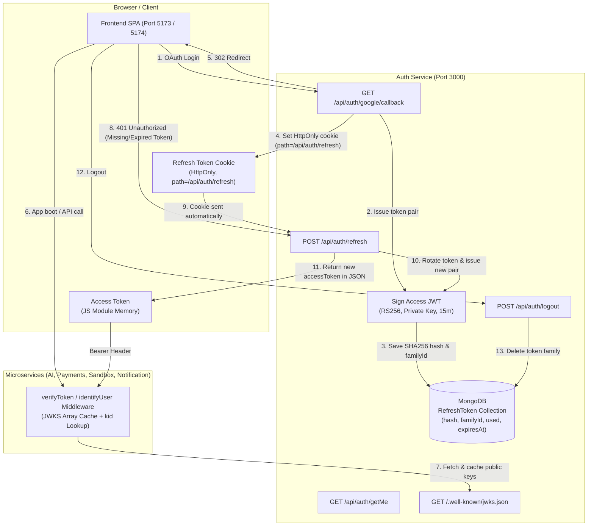

# Authentication & Security Architecture — Taksha Platform Documentation

## Overview

Taksha utilizes an enterprise-grade authentication and authorization system based on **RS256 Access Tokens (verified via JWKS)** combined with **Rotating, Reuse-Detected Refresh Tokens**.

### Core Architecture Goals
- **Stateless Microservice Verification**: Downstream microservices (AI Orchestration, Payments, Sandbox, Notification) verify access tokens locally using JWKS without making database calls or contacting the Auth Service on every request.
- **XSS Protection**: Access tokens are **never** stored in `localStorage`, `sessionStorage`, or cookies. They reside strictly in JavaScript module closure memory (`_accessToken`).
- **CSRF & Theft Protection**: Refresh tokens are opaque 128-hex random strings stored in an `HttpOnly`, `SameSite=Lax` cookie scoped strictly to `path: '/api/auth/refresh'`.
- **Replay Attack Revocation**: If a stolen or already-rotated refresh token is used, the system detects the replay attack and revokes the **entire token family** (all sessions for that login).

---

## 1. System Architecture & Component Interaction



---

## 2. The Two Tokens

| Property | Access Token | Refresh Token |
| :--- | :--- | :--- |
| **Type** | RS256 Asymmetric JWT | Opaque Random 128-char Hex String |
| **Lifetime** | Short-lived (15 minutes) | Long-lived (30 days) |
| **Storage Location** | Frontend JS module memory (`_accessToken`) | `HttpOnly`, `SameSite=Lax` Cookie |
| **Cookie Path Scope** | None (not in any cookie) | `path: '/api/auth/refresh'` |
| **Transmission** | `Authorization: Bearer <JWT>` header | Sent automatically by browser to `/refresh` |
| **Verification** | Verified locally via JWKS by microservices | Verified against SHA256 hash in MongoDB by Auth Service |
| **Database Storage** | Stateless (not stored in DB) | SHA256 hash stored in `RefreshToken` collection |

---

## 3. Data Model & Database Schema

### MongoDB Refresh Token Schema (`Auth/src/models/refreshToken.model.js`)

Refresh tokens are never stored in raw plaintext. Only their SHA256 hash is saved in MongoDB alongside their rotation `familyId`.

```javascript
import mongoose from 'mongoose';

const refreshTokenSchema = new mongoose.Schema({
    userId: {
        type: mongoose.Schema.Types.ObjectId,
        ref: 'User',
        required: true,
        index: true,
    },
    tokenHash: {
        type: String,
        required: true,
        unique: true,
    },
    familyId: {
        type: String,
        required: true,
        index: true,
    },
    used: {
        type: Boolean,
        default: false,
    },
    expiresAt: {
        type: Date,
        required: true,
    },
}, { timestamps: true });

// Automatic MongoDB TTL index for document cleanup after expiry
refreshTokenSchema.index({ expiresAt: 1 }, { expireAfterSeconds: 0 });

export default mongoose.model('RefreshToken', refreshTokenSchema);
```

---

## 4. Auth Service Token Issuance & Controllers

### 4.1 Token Issuance Helper (`Auth/src/utils/generateTokens.js`)

```javascript
import jwt from 'jsonwebtoken';
import crypto from 'crypto';
import RefreshToken from '../models/refreshToken.model.js';

const JWT_OPTIONS = {
    algorithm: 'RS256',
    issuer: 'auth.takshacodespace.in',
    audience: 'takshacodespace-services',
    keyid: 'auth-rsa-v1', // Matches kid in /.well-known/jwks.json
};

export const hashToken = (rawToken) => {
    return crypto.createHash('sha256').update(rawToken).digest('hex');
};

export const signAccessToken = (user) => jwt.sign(
    {
        sub: String(user._id || user.id),
        id: String(user._id || user.id),
        email: user.email,
        name: user.name,
        role: user.role || 'user',
    },
    PRIVATE_KEY,
    { ...JWT_OPTIONS, expiresIn: '15m' }
);

export const issueTokenPair = async (user, familyId = null) => {
    const accessToken = signAccessToken(user);
    const rawRefreshToken = crypto.randomBytes(64).toString('hex');
    const tokenHash = hashToken(rawRefreshToken);
    const activeFamilyId = familyId || crypto.randomUUID();

    const expiresAt = new Date(Date.now() + 30 * 24 * 60 * 60 * 1000);
    await RefreshToken.create({
        userId: user._id || user.id,
        tokenHash,
        familyId: activeFamilyId,
        expiresAt,
    });

    return {
        accessToken,
        refreshToken: rawRefreshToken,
        familyId: activeFamilyId,
    };
};

export const setRefreshCookie = (res, rawRefreshToken) => {
    res.cookie('refreshToken', rawRefreshToken, {
        httpOnly: true,
        secure: process.env.NODE_ENV === 'production',
        sameSite: 'lax',
        path: '/api/auth/refresh',
        maxAge: 30 * 24 * 60 * 60 * 1000, // 30 days
    });
};
```

---

### 4.2 OAuth Callback & Refresh Controllers (`Auth/src/controllers/auth.controller.js`)

```javascript
/**
 * Google OAuth Callback
 */
export const authGoogleCallbackController = async (req, res, next) => {
    try {
        const { id, displayName, emails, photos } = req.user;
        let user = await User.findOne({ googleId: id });
        if (!user) {
            user = await User.create({
                googleId: id,
                name: displayName,
                email: emails[0].value,
                photo: photos[0].value,
            });
        }

        const { refreshToken } = await issueTokenPair(user);
        setRefreshCookie(res, refreshToken);

        const clientUrl = process.env.CLIENT_URL || 'http://localhost:5173';
        res.redirect(clientUrl);
    } catch (err) {
        next(err);
    }
};

/**
 * Token Refresh Controller (Rotation + Replay Detection)
 */
export const authGenerateAccessToken = async (req, res, next) => {
    try {
        const rawRefreshToken = req.cookies.refreshToken;
        if (!rawRefreshToken) {
            return res.status(401).json({ status: 'error', message: 'No refresh token provided' });
        }

        const tokenHash = hashToken(rawRefreshToken);
        const stored = await RefreshToken.findOne({ tokenHash });

        if (!stored || stored.expiresAt < new Date()) {
            res.clearCookie('refreshToken', { path: '/api/auth/refresh' });
            return res.status(401).json({ status: 'error', message: 'Invalid or expired refresh token' });
        }

        // REUSE DETECTED: Old token replayed → Revoke entire token family
        if (stored.used) {
            console.warn(`[Security Alert] Token reuse detected for family ${stored.familyId}! Revoking family.`);
            await RefreshToken.deleteMany({ familyId: stored.familyId });
            res.clearCookie('refreshToken', { path: '/api/auth/refresh' });
            return res.status(401).json({ status: 'error', message: 'Token reuse detected — all sessions revoked' });
        }

        // Mark old token as used (rotated)
        stored.used = true;
        await stored.save();

        const user = await User.findById(stored.userId);
        if (!user) {
            return res.status(401).json({ status: 'error', message: 'User no longer exists' });
        }

        // Issue new pair in the SAME rotation family
        const { accessToken, refreshToken: newRefreshToken } = await issueTokenPair(user, stored.familyId);
        setRefreshCookie(res, newRefreshToken);

        res.status(200).json({
            status: "success",
            message: "Access token refreshed successfully",
            accessToken,
        });
    } catch (err) {
        next(err);
    }
};
```

---

## 5. Microservice-Level Verification Logic

All downstream microservices (AI Orchestration, Payments, Sandbox Server, Notification) verify incoming JWT access tokens **locally** without making database queries or contacting the Auth Service on every request.

### 5.1 Verification Architecture & Flow

```
Incoming Request (e.g. POST /api/ai/chat)
   │
   ├─► 1. Extract Header: Authorization: Bearer <JWT>
   │
   ├─► 2. Decode JWT Header (Unverified): Extract 'kid' claim (e.g., "auth-rsa-v1")
   │
   ├─► 3. JWKS Cache Lookup:
   │      - Search cached JWK array for matching 'kid'
   │      - If not found or stale (cache miss): fetch latest JWKS from http://auth-service/.well-known/jwks.json
   │      - Derive RSA Public Key PEM from JWK
   │
   ├─► 4. RS256 Verification (jwt.verify):
   │      - Verify RSA signature with public key PEM
   │      - Validate Expiration (exp), Issuer (iss), and Audience (aud)
   │
   ├─► 5. Identity Claim Validation:
   │      - Extract 'sub' or 'id' (User ID)
   │
   └─► 6. Attach req.user and call next()
```

---

### 5.2 Microservice Verification Code (`verifyToken` / `identifyUser`)

The exact production verification implementation used across microservices:

```javascript
import jwt from 'jsonwebtoken';
import { createPublicKey } from 'crypto';

const AUTH_JWKS_URI = process.env.AUTH_JWKS_URI || 'http://auth-service/.well-known/jwks.json';

const JWT_VERIFY_OPTIONS = {
    algorithms: ['RS256'],
    issuer: 'auth.takshacodespace.in',
    audience: 'takshacodespace-services',
};

// ── JWKS Key Cache ─────────────────────────────────────────────────────────
// Caches the full JWK array (not a single key) to support zero-downtime key rotation overlap windows.
let cachedJwks = null;
let lastFetchedTime = 0;
const CACHE_TTL_MS = 24 * 60 * 60 * 1000; // 24 Hours

async function fetchJwks(forceRefresh = false) {
    const now = Date.now();
    if (!forceRefresh && cachedJwks && (now - lastFetchedTime < CACHE_TTL_MS)) {
        return cachedJwks;
    }

    try {
        const response = await fetch(AUTH_JWKS_URI);
        if (!response.ok) throw new Error(`HTTP ${response.status}: ${response.statusText}`);

        const data = await response.json();
        if (!data.keys || data.keys.length === 0) throw new Error('JWKS response contained no keys');

        cachedJwks = data.keys;
        lastFetchedTime = now;
        return cachedJwks;
    } catch (err) {
        if (cachedJwks) return cachedJwks; // Serve stale cache on transient Auth network failure
        throw new Error(`Failed to fetch JWKS from Auth Service (${AUTH_JWKS_URI}): ${err.message}`);
    }
}

/**
 * Resolves the correct Public Key PEM for the token's kid claim
 */
async function resolvePublicKey(token) {
    // Decode header claim without verifying payload signature yet
    const header = jwt.decode(token, { complete: true })?.header;
    if (!header?.kid) throw new Error('Token is missing the kid (key ID) header claim');

    let keys = await fetchJwks();
    let jwk = keys.find(k => k.kid === header.kid);

    // If kid is missing from cache, a new key may have rotated in — force refetch once
    if (!jwk) {
        keys = await fetchJwks(true);
        jwk = keys.find(k => k.kid === header.kid);
    }

    if (!jwk) throw new Error(`No JWKS entry found for kid="${header.kid}"`);

    // Derive SPKI PEM from matching JWK object
    return createPublicKey({ key: jwk, format: 'jwk' }).export({ type: 'spki', format: 'pem' });
}

// ── Middleware Function ──────────────────────────────────────────────────────
export const verifyToken = async (req, res, next) => {
    const authHeader = req.headers.authorization;
    if (!authHeader || !authHeader.startsWith('Bearer ')) {
        return res.status(401).json({
            status: 'error',
            message: 'Unauthorized: Missing Authorization header. Expected: Bearer <JWT>',
        });
    }

    const token = authHeader.split(' ')[1];
    if (!token) {
        return res.status(401).json({ status: 'error', message: 'Unauthorized: Bearer token value is empty.' });
    }

    try {
        // 1. Dynamic Key Resolution by kid
        const publicKeyPem = await resolvePublicKey(token);

        // 2. Cryptographic Signature & Expiry Verification
        const decoded = jwt.verify(token, publicKeyPem, JWT_VERIFY_OPTIONS);

        // 3. Identity Claim Verification
        const userId = decoded?.sub || decoded?.id;
        if (!decoded || !userId) {
            return res.status(401).json({
                status: 'error',
                message: 'Unauthorized: Token payload is missing required identity claims (sub / id).',
            });
        }

        // Attach verified identity to request
        req.user = {
            id: userId,
            email: decoded.email,
            name: decoded.name,
            role: decoded.role || 'user',
        };
        req.authToken = token;

        next();
    } catch (err) {
        const isExpired = err.name === 'TokenExpiredError';
        return res.status(401).json({
            status: 'error',
            message: isExpired ? 'Unauthorized: Access token expired. Please refresh.' : `Unauthorized: ${err.message}`,
            expired: isExpired,
        });
    }
};
```

---

### 5.3 Microservice Blacklist Policy & Rationale

| Microservice | Checks Redis Blacklist? | Architectural Rationale |
| :--- | :--- | :--- |
| **Auth Service** | ✅ Yes | Manages user sessions, password changes, and explicit logout revocation. |
| **Payments Service** | ✅ Yes | Financial operations (credits/purchases). Prevents logged-out tokens from executing transactions during the 15-min window. |
| **AI Orchestration** | ❌ No | High-throughput AI streaming. Skips Redis call per request to minimize latency; accepts the 15-minute token TTL window. |
| **Sandbox Server** | ❌ No | Container lifecycle operations. Access token TTL window is accepted; sandbox operations check user ownership in DB. |
| **Notification Service** | ❌ No | Low-risk background notification preferences and emails. Accepts 15-minute token TTL window. |

---

## 6. Frontend Interceptor & In-Memory Token Management

### In-Memory Storage (`Frontend/src/services/apiClient.js`)

```javascript
import axios from 'axios';

let _accessToken = null;

export const setAccessToken = (token) => { _accessToken = token; };
export const clearAccessToken = () => { _accessToken = null; };
export const getAccessToken = () => _accessToken;

export const apiClient = axios.create({
    withCredentials: true,
});

// Inject Authorization header from module memory
apiClient.interceptors.request.use((config) => {
    if (_accessToken) {
        config.headers.Authorization = `Bearer ${_accessToken}`;
    }
    return config;
});

// Response interceptor: Transparent token refresh on 401
let isRefreshing = false;
let failedQueue = [];

const processQueue = (error, token = null) => {
    failedQueue.forEach(prom => error ? prom.reject(error) : prom.resolve(token));
    failedQueue = [];
};

apiClient.interceptors.response.use(
    (response) => response,
    async (error) => {
        const originalRequest = error?.config;
        if (!originalRequest) return Promise.reject(error);

        const isAuthEndpoint = originalRequest.url?.includes('/api/auth/refresh') ||
                               originalRequest.url?.includes('/api/auth/logout');

        if (error?.response?.status === 401 && !originalRequest._retry && !isAuthEndpoint) {
            if (isRefreshing) {
                return new Promise((resolve, reject) => {
                    failedQueue.push({ resolve, reject });
                }).then((token) => {
                    originalRequest.headers.Authorization = `Bearer ${token}`;
                    return apiClient(originalRequest);
                });
            }

            originalRequest._retry = true;
            isRefreshing = true;

            try {
                // Post to /refresh — HttpOnly refresh cookie is automatically sent by browser
                const refreshRes = await axios.post('/api/auth/refresh', {}, { withCredentials: true });
                const newToken = refreshRes.data?.accessToken;

                setAccessToken(newToken);
                processQueue(null, newToken);

                originalRequest.headers.Authorization = `Bearer ${newToken}`;
                return apiClient(originalRequest);
            } catch (refreshErr) {
                processQueue(refreshErr, null);
                clearAccessToken();
                return Promise.reject(refreshErr);
            } finally {
                isRefreshing = false;
            }
        }
        return Promise.reject(error);
    }
);
```

---

## 7. Zero-Downtime Key Rotation Procedure

When Auth Service rotates its RSA signing key pair:

1. **Phase 1 (Dual-Key Publication)**: Auth Service serves both the old and new public keys in `/.well-known/jwks.json`:
   ```json
   {
     "keys": [
       { "kid": "auth-rsa-v1", "kty": "RSA", "alg": "RS256", "use": "sig", "n": "...", "e": "AQAB" },
       { "kid": "auth-rsa-v2", "kty": "RSA", "alg": "RS256", "use": "sig", "n": "...", "e": "AQAB" }
     ]
   }
   ```
2. **Phase 2 (Signing Switch)**: Auth Service switches new token issuance to `auth-rsa-v2`. Existing active access tokens (`auth-rsa-v1`) remain valid and pass verification in microservices because `verifyToken` matches keys by `kid`.
3. **Phase 3 (Old Key Removal)**: After 15 minutes (max access token lifetime), all old tokens have expired. Auth Service removes `auth-rsa-v1` from JWKS. Microservices drop the old key on their next 24-hour cache refresh.

---

## 8. Summary Checklist for Developers

- [x] **No Access Token Cookies**: Access tokens must never be written to `document.cookie` or returned in cookie headers.
- [x] **In-Memory Storage Only**: Frontend must store access tokens strictly in memory variables (`setAccessToken`).
- [x] **HttpOnly Refresh Cookie Scoping**: Refresh cookies must have `path: '/api/auth/refresh'`, `httpOnly: true`, `sameSite: 'lax'`.
- [x] **Replay Attack Revocation**: Refresh controller must track `used: true` and revoke the whole `familyId` on reuse.
- [x] **Microservice Verification**: Use Node.js `crypto.createPublicKey` to convert JWK to PEM, match by `kid`, and verify RS256 signature locally.