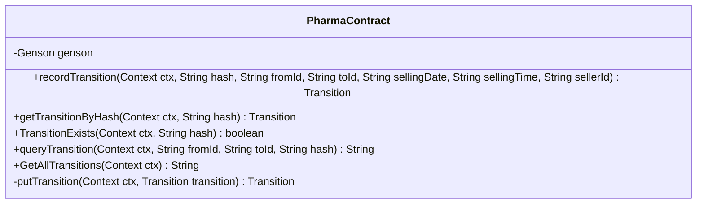
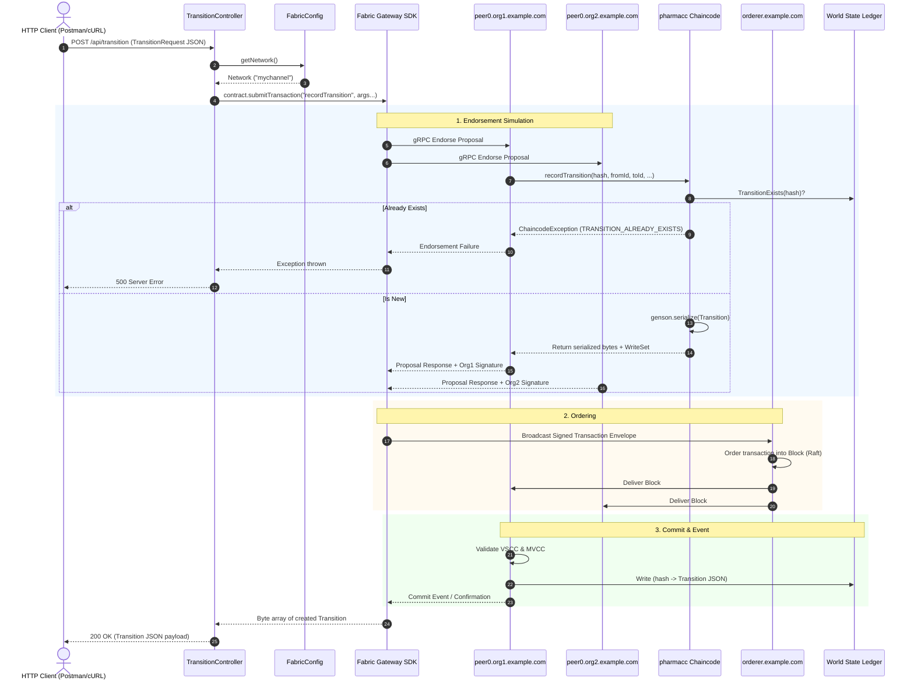
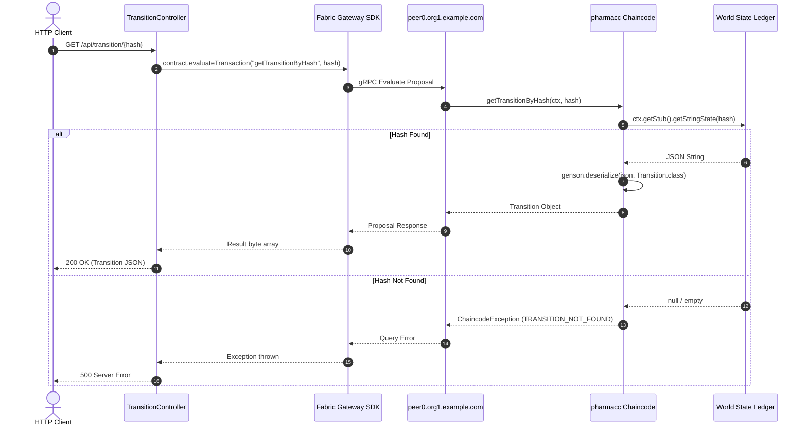
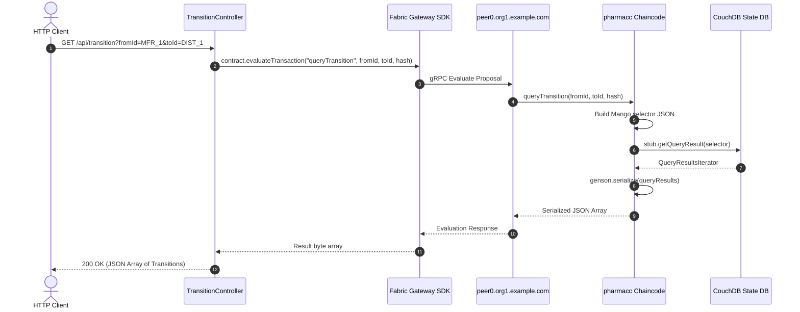

# 💊 Pharma Blockchain Supply Chain — Architecture & Execution Flow

> **Project:** Smart India Hackathon (SIH 2026) — Blockchain Pharma Transition Ledger  
> **Repository:** `sshekhar-04/SIH_2026`  
> **Implemented Stack:** Hyperledger Fabric v2.5 (Java Chaincode), Spring Boot 4.1.0 (Fabric Gateway SDK 1.5.1), gRPC Netty 1.80.0, Docker, WSL2 (Ubuntu)  

---

## 📑 Table of Contents

1. [Project Overview & Core Goal](#1-project-overview--core-goal)
2. [Complete System Architecture](#2-complete-system-architecture)
3. [Repository File Map](#3-repository-file-map)
4. [Data Model & Ledger State (`Transition`)](#4-data-model--ledger-state-transition)
5. [Smart Contract Implementation (`PharmaContract.java`)](#5-smart-contract-implementation-pharmacontractjava)
6. [Backend Gateway Implementation (`pharma-backend`)](#6-backend-gateway-implementation-pharma-backend)
7. [REST API Specification](#7-rest-api-specification)
8. [End-to-End Execution Flows & Lifecycle](#8-end-to-end-execution-flows--lifecycle)
   - 8.1 [Write Execution Flow (`POST /api/transition`)](#81-write-execution-flow-recordtransition)
   - 8.2 [Direct Read Execution Flow (`GET /api/transition/{hash}`)](#82-direct-read-execution-flow-gettransitionbyhash)
   - 8.3 [Rich Query Execution Flow (`GET /api/transition`)](#83-rich-query-execution-flow-querytransition)
9. [Step-by-Step Execution Guide (Setup, Deploy & Run)](#9-step-by-step-execution-guide-setup-deploy--run)
10. [PKI, Identity & TLS Security Configuration](#10-pki-identity--tls-security-configuration)
11. [Troubleshooting & Execution Gotchas](#11-troubleshooting--execution-gotchas)

---

## 1. Project Overview & Core Goal

### 1.1 Goal of the Implemented System
The objective of this codebase is to provide a **tamper-proof, permissioned blockchain ledger** that records and verifies custody transitions of pharmaceutical units (from manufacturer, distributor, pharmacy/seller, down to customer/buyer) using unique cryptographic unit hashes (QR code payloads).

### 1.2 What the Codebase Implements
1. **Chaincode (`pharmacc`)**:
   - Stores immutable `Transition` records keyed by unique `hash`.
   - Prevents duplicate asset creation (rejects already existing hashes).
   - Allows direct key lookup (`getTransitionByHash`).
   - Supports rich dynamic queries using CouchDB Mango selectors (`fromId`, `toId`, `hash`).
   - Supports ledger-wide state iteration (`GetAllTransitions`).
2. **Backend API Gateway (`pharma-backend`)**:
   - A Spring Boot REST application interfacing directly with Hyperledger Fabric peer nodes via Fabric Gateway SDK and gRPC over mTLS.
   - Converts standard JSON HTTP REST requests into signed Fabric transaction proposals.

---

## 2. Complete System Architecture

The codebase operates across two main tiers: the **Spring Boot REST Gateway** and the **Hyperledger Fabric Blockchain Network**.

```mermaid
flowchart TB
    subgraph Client ["Client / Consumer / Frontend Layer"]
        HTTPClient["HTTP REST Client\n(Postman / cURL / Frontend App)"]
    end

    subgraph BackendGateway ["Spring Boot Backend Gateway (pharma-backend:8080)"]
        Controller["TransitionController\n(/api/transition)"]
        ReqDTO["TransitionRequest (DTO)"]
        Config["FabricConfig (Singleton)\n(Identities, Signers, ManagedChannel)"]
        GatewayClient["Fabric Gateway Client (v1.5.1)"]
    end

    subgraph FabricNetwork ["Hyperledger Fabric Network (mychannel)"]
        subgraph PeerOrg1 ["Org1 (Org1MSP)"]
            Peer1["peer0.org1.example.com\n(Port: 7051)"]
            CertOrg1["User1@org1.example.com\n(X.509 cert + keystore)"]
            CA1["ca.crt (TLS CA)"]
        end

        subgraph PeerOrg2 ["Org2 (Org2MSP)"]
            Peer2["peer0.org2.example.com\n(Port: 9051)"]
        end

        subgraph OrdererGroup ["Ordering Service"]
            Orderer["orderer.example.com\n(Raft Consensus - Port: 7050)"]
        end

        subgraph ChaincodeContainer ["Java Chaincode Container (pharmacc)"]
            Contract["PharmaContract\n(fabric-chaincode-shim 2.5)"]
            Entity["Transition\n(Genson JSON Serializer)"]
        end

        subgraph LedgerStore ["Ledger Storage"]
            WorldState["World State DB\n(Key = hash, Value = Transition JSON)"]
            BlockStore["Blockchain Log (Blocks)"]
        end
    end

    HTTPClient -->|HTTP POST / GET| Controller
    Controller --> ReqDTO
    Controller --> Config
    Config --> GatewayClient
    GatewayClient -->|gRPC TLS (localhost:7051)| Peer1
    GatewayClient -.->|Endorsement Proposal| Peer2
    GatewayClient -->|Broadcast Envelope| Orderer
    
    Peer1 <--> ChaincodeContainer
    Peer2 <--> ChaincodeContainer
    Orderer -->|Deliver Block| Peer1
    Orderer -->|Deliver Block| Peer2
    Peer1 --> WorldState
    Peer1 --> BlockStore
```

---

## 3. Repository File Map

```
SIH_2026/
├── README.md                               # Project description
├── SETUP.md                                # Detailed WSL2 / Docker / Fabric setup manual
├── Blockchain_backend_api_endPoints.png    # API endpoints reference sheet
├── flow.md                                 # Complete architecture and execution flow document
│
├── backend/                                # Spring Boot Application (org.pharma.pharma_backend)
│   ├── build.gradle                        # Dependencies: spring-boot-starter-web, fabric-gateway 1.5.1, grpc-netty 1.80.0
│   ├── settings.gradle                     # Project name: pharma-backend
│   ├── gradlew / gradlew.bat               # Gradle wrapper
│   ├── HELP.md                             # Spring Boot build references
│   └── src/main/
│       ├── resources/
│       │   └── application.properties      # spring.application.name=pharma-backend
│       └── java/org/pharma/pharma_backend/
│           ├── PharmaBackendApplication.java # Main application bootstrap
│           ├── FabricConfig.java           # Fabric Gateway connection factory & TLS credentials
│           ├── TransitionRequest.java      # Request body DTO
│           └── TransitionController.java   # REST Controller for /api/transition
│
└── chaincode/                              # Java Chaincode (org.hyperledger.fabric.samples.assettransfer)
    ├── Dockerfile                          # Multi-stage build (gradle:9-jdk25 -> eclipse-temurin:25-jre)
    ├── build.gradle                        # fabric-chaincode-shim 2.5, genson 1.6, shadowJar
    ├── settings.gradle                     # Project name: chaincode-pharma-java
    ├── gradlew / gradlew.bat               # Gradle wrapper
    ├── README.md                           # Chaincode sample readme
    ├── config/checkstyle/                  # Checkstyle configuration files
    ├── docker/
    │   └── docker-entrypoint.sh            # Chaincode container startup entrypoint
    └── src/main/java/org/hyperledger/fabric/samples/assettransfer/
        ├── Transition.java                 # Domain entity class with Genson annotations
        └── PharmaContract.java             # Contract methods: recordTransition, getTransitionByHash, queryTransition, etc.
```

---

## 4. Data Model & Ledger State (`Transition`)

### 4.1 Class Definition (`Transition.java`)
The asset stored in the blockchain ledger is defined in `Transition.java`:

```java
@DataType()
public final class Transition {

    @Property()
    private final String docType = "transition";

    @Property()
    private final String hash;

    @Property()
    private final String fromId;

    @Property()
    private final String toId;

    @Property()
    private final String sellingDate;

    @Property()
    private final String sellingTime;

    @Property()
    private final String sellerId;
    
    // Constructor with @JsonProperty bindings, getters, equals, hashCode, toString
}
```

### 4.2 Field Specifications
| Field | Type | Description | Source / Purpose |
| :--- | :--- | :--- | :--- |
| `docType` | `String` | `"transition"` | Constant discriminator used for CouchDB queries |
| `hash` | `String` | Unique Unit Identifier | Key on the ledger (e.g. QR payload / unit serial hash) |
| `fromId` | `String` | Origin Entity ID | ID of transferring party (e.g., Manufacturer / Distributor / Pharmacy) |
| `toId` | `String` | Destination Entity ID | ID of receiving party (e.g., Distributor / Pharmacy / Customer) |
| `sellingDate` | `String` | Handover Date | Format `ddmmyyyy` (e.g. `"20082026"`) |
| `sellingTime` | `String` | Handover Time | Format `hh:mm:ss` (e.g. `"19:30:00"`) |
| `sellerId` | `String` | Operator / License ID | ID of the specific seller recording the transition |

### 4.3 Storage Representation
On the Hyperledger Fabric ledger:
- **State Key**: `hash` (e.g., `"MED-12345"`)
- **State Value**: Deterministic JSON serialized by `com.owlike.genson.Genson`

```json
{
  "docType": "transition",
  "hash": "MED-12345",
  "fromId": "SHOP_PHARMA_001",
  "toId": "PATIENT_999",
  "sellingDate": "20082026",
  "sellingTime": "19:30:00",
  "sellerId": "SELLER_456"
}
```

---

## 5. Smart Contract Implementation (`PharmaContract.java`)

`PharmaContract` implements `ContractInterface` under the chaincode name `pharmacc`.

### 5.1 Contract Methods and Functionality



### 5.2 Method Details

#### 1. `recordTransition`
- **Transaction Intent**: `Transaction.TYPE.SUBMIT` (Modifies World State, creates a block).
- **Parameters**: `(ctx, hash, fromId, toId, sellingDate, sellingTime, sellerId)`
- **Logic**:
  1. Executes `TransitionExists(ctx, hash)`.
  2. If exists $\rightarrow$ Throws `ChaincodeException("Transition with hash ... already exists", "TRANSITION_ALREADY_EXISTS")`.
  3. If not $\rightarrow$ Serializes new `Transition` via `genson.serialize(...)` and calls `ctx.getStub().putStringState(hash, sortedJson)`.
  4. Returns the created `Transition`.

#### 2. `getTransitionByHash`
- **Transaction Intent**: `Transaction.TYPE.EVALUATE` (Read-only query, does not alter state).
- **Parameters**: `(ctx, hash)`
- **Logic**:
  1. Calls `ctx.getStub().getStringState(hash)`.
  2. If result is `null` or empty $\rightarrow$ Throws `ChaincodeException("Transition with hash ... does not exist", "TRANSITION_NOT_FOUND")`.
  3. Deserializes JSON string back into `Transition` and returns it.

#### 3. `TransitionExists`
- **Transaction Intent**: `Transaction.TYPE.EVALUATE`
- **Parameters**: `(ctx, hash)`
- **Logic**:
  1. Calls `ctx.getStub().getStringState(hash)`.
  2. Returns `true` if non-null and not empty; otherwise `false`.

#### 4. `queryTransition`
- **Transaction Intent**: `Transaction.TYPE.EVALUATE`
- **Parameters**: `(ctx, fromId, toId, hash)`
- **Logic**:
  1. Dynamically constructs CouchDB JSON selector string:
     ```json
     {"selector":{"docType":"transition","fromId":"...","toId":"...","hash":"..."}}
     ```
  2. Omits filter fields if empty string `""` or `null` is passed.
  3. Executes `stub.getQueryResult(selector.toString())`.
  4. Iterates results, deserializes each into `Transition`, and returns a serialized JSON array string.

#### 5. `GetAllTransitions`
- **Transaction Intent**: `Transaction.TYPE.EVALUATE`
- **Parameters**: `(ctx)`
- **Logic**:
  1. Executes `stub.getStateByRange("", "")` to perform a full lexical key range scan.
  2. Collects and deserializes all records into `List<Transition>`.
  3. Returns serialized JSON array string.

---

## 6. Backend Gateway Implementation (`pharma-backend`)

### 6.1 `FabricConfig.java` (Connection Factory)
Creates and manages the singleton connection to `peer0.org1.example.com`:

```java
public final class FabricConfig {
    private static final String CHANNEL_NAME = "mychannel";
    private static final String MSP_ID = "Org1MSP";

    private static final Path CERT_PATH = Path.of(
        "/home/jarvis/fabric-samples/test-network/organizations/peerOrganizations/org1.example.com/users/User1@org1.example.com/msp/signcerts/cert.pem");
    private static final Path KEY_DIR = Path.of(
        "/home/jarvis/fabric-samples/test-network/organizations/peerOrganizations/org1.example.com/users/User1@org1.example.com/msp/keystore");
    private static final Path TLS_CERT_PATH = Path.of(
        "/home/jarvis/fabric-samples/test-network/organizations/peerOrganizations/org1.example.com/peers/peer0.org1.example.com/tls/ca.crt");

    private static final String PEER_ENDPOINT = "localhost:7051";
    private static final String OVERRIDE_AUTH = "peer0.org1.example.com";

    private static Gateway gateway;
    private static ManagedChannel channel;

    public static synchronized Network getNetwork() throws Exception {
        if (gateway == null) {
            var credentials = TlsChannelCredentials.newBuilder()
                    .trustManager(TLS_CERT_PATH.toFile())
                    .build();

            channel = Grpc.newChannelBuilder(PEER_ENDPOINT, credentials)
                    .overrideAuthority(OVERRIDE_AUTH)
                    .build();

            X509Certificate cert = Identities.readX509Certificate(Files.newBufferedReader(CERT_PATH));
            Path keyFile = Files.list(KEY_DIR).findFirst().orElseThrow();
            PrivateKey privateKey = Identities.readPrivateKey(Files.newBufferedReader(keyFile));

            gateway = Gateway.newInstance()
                    .identity(new X509Identity(MSP_ID, cert))
                    .signer(Signers.newPrivateKeySigner(privateKey))
                    .connection(channel)
                    .connect();
        }
        return gateway.getNetwork(CHANNEL_NAME);
    }
}
```

### 6.2 `TransitionRequest.java` (DTO)
```java
public class TransitionRequest {
    public String hash;
    public String fromId;
    public String toId;
    public String sellingDate;
    public String sellingTime;
    public String sellerId;
}
```

### 6.3 `TransitionController.java` (REST Endpoints)
```java
@RestController
@RequestMapping("/api/transition")
public class TransitionController {

    private Contract getContract() throws Exception {
        Network network = FabricConfig.getNetwork();
        return network.getContract("pharmacc");
    }

    @PostMapping
    public String recordTransition(@RequestBody TransitionRequest req) throws Exception {
        byte[] result = getContract().submitTransaction(
            "recordTransition",
            req.hash, req.fromId, req.toId, req.sellingDate, req.sellingTime, req.sellerId
        );
        return new String(result);
    }

    @GetMapping("/{hash}")
    public String getByHash(@PathVariable String hash) throws Exception {
        byte[] result = getContract().evaluateTransaction("getTransitionByHash", hash);
        return new String(result);
    }

    @GetMapping
    public String query(@RequestParam(required = false, defaultValue = "") String fromId,
                         @RequestParam(required = false, defaultValue = "") String toId,
                         @RequestParam(required = false, defaultValue = "") String hash) throws Exception {
        byte[] result = getContract().evaluateTransaction("queryTransition", fromId, toId, hash);
        return new String(result);
    }
}
```

---

## 7. REST API Specification

### Base URI
`http://localhost:8080/api/transition`

---

### Endpoint 1: Record Transition
- **Method**: `POST`
- **Path**: `/api/transition`
- **Headers**: `Content-Type: application/json`
- **Request Body**:
```json
{
  "hash": "MED_UNIT_98765",
  "fromId": "MANUFACTURER_CIPLA",
  "toId": "DISTRIBUTOR_APOLLO",
  "sellingDate": "20082026",
  "sellingTime": "14:20:00",
  "sellerId": "MFR_OPERATOR_12"
}
```
- **Response**: `200 OK`
```json
{
  "docType": "transition",
  "hash": "MED_UNIT_98765",
  "fromId": "MANUFACTURER_CIPLA",
  "toId": "DISTRIBUTOR_APOLLO",
  "sellingDate": "20082026",
  "sellingTime": "14:20:00",
  "sellerId": "MFR_OPERATOR_12"
}
```

---

### Endpoint 2: Get Transition by Hash
- **Method**: `GET`
- **Path**: `/api/transition/{hash}`
- **Path Parameter**: `hash` (e.g. `MED_UNIT_98765`)
- **Response**: `200 OK`
```json
{
  "docType": "transition",
  "hash": "MED_UNIT_98765",
  "fromId": "MANUFACTURER_CIPLA",
  "toId": "DISTRIBUTOR_APOLLO",
  "sellingDate": "20082026",
  "sellingTime": "14:20:00",
  "sellerId": "MFR_OPERATOR_12"
}
```

---

### Endpoint 3: Query Transitions (Filtered / All)
- **Method**: `GET`
- **Path**: `/api/transition`
- **Query Parameters** *(all optional)*:
  - `fromId` (String): Filter by transferring party
  - `toId` (String): Filter by receiving party
  - `hash` (String): Filter by hash
- **Example Call**: `GET /api/transition?fromId=MANUFACTURER_CIPLA`
- **Response**: `200 OK`
```json
[
  {
    "docType": "transition",
    "hash": "MED_UNIT_98765",
    "fromId": "MANUFACTURER_CIPLA",
    "toId": "DISTRIBUTOR_APOLLO",
    "sellingDate": "20082026",
    "sellingTime": "14:20:00",
    "sellerId": "MFR_OPERATOR_12"
  }
]
```

---

## 8. End-to-End Execution Flows & Lifecycle

### 8.1 Write Execution Flow (`recordTransition`)



---

### 8.2 Direct Read Execution Flow (`getTransitionByHash`)



---

### 8.3 Rich Query Execution Flow (`queryTransition`)



---

## 9. Step-by-Step Execution Guide (Setup, Deploy & Run)

### 9.1 Prerequisites
- Windows 11 with WSL2 (Ubuntu) or native Linux/macOS
- OpenJDK 17 (`openjdk-17-jdk`)
- Docker Desktop with WSL2 integration
- `fabric-samples` directory

---

### 9.2 Execution Steps

#### Step 1: Start Fabric Test Network
```bash
# Open WSL2 Ubuntu Terminal
cd ~/fabric-samples/test-network

# Clean prior state and create channel with CAs
./network.sh down
./network.sh up createChannel -c mychannel -ca
```

#### Step 2: Deploy Java Chaincode (`pharmacc`)
```bash
cd ~/fabric-samples/test-network

# Deploy chaincode from local directory
./network.sh deployCC -ccn pharmacc -ccp ../chaincode-pharma-java -ccl java
```

#### Step 3: Verify Running Containers
```bash
docker ps
```
Required active containers:
- `orderer.example.com`
- `peer0.org1.example.com`
- `peer0.org2.example.com`
- `ca_org1`, `ca_org2`, `ca_orderer`
- `dev-peer0.org1.example.com-pharmacc_1.0-...`
- `dev-peer0.org2.example.com-pharmacc_1.0-...`

#### Step 4: Run Spring Boot Backend
```bash
cd /path/to/SIH_2026/backend
./gradlew bootRun
```
*Application boots on `http://localhost:8080` and connects to `peer0.org1.example.com:7051`.*

#### Step 5: Test Endpoints via cURL

**1. Create a Transition (POST):**
```bash
curl -X POST http://localhost:8080/api/transition \
  -H "Content-Type: application/json" \
  -d '{
    "hash": "HASH-9988-ABC",
    "fromId": "MFR-SUNPHARMA",
    "toId": "DIST-APOLLO",
    "sellingDate": "20082026",
    "sellingTime": "18:00:00",
    "sellerId": "OP-01"
  }'
```

**2. Query by Hash (GET):**
```bash
curl http://localhost:8080/api/transition/HASH-9988-ABC
```

**3. Filter by Sender (GET):**
```bash
curl "http://localhost:8080/api/transition?fromId=MFR-SUNPHARMA"
```

#### Step 6: Shutdown Network
```bash
cd ~/fabric-samples/test-network
./network.sh down
```

---

## 10. PKI, Identity & TLS Security Configuration

The gateway connects using the cryptographic identity generated by the test network:

| Component | Path / Configuration | Purpose |
| :--- | :--- | :--- |
| **TLS CA Root Certificate** | `.../peers/peer0.org1.example.com/tls/ca.crt` | Validates peer server certificate during TLS handshake |
| **User Sign Certificate** | `.../users/User1@org1.example.com/msp/signcerts/cert.pem` | X.509 client certificate for transaction identity (`Org1MSP`) |
| **User Private Key** | `.../users/User1@org1.example.com/msp/keystore/*` | ECDSA private key used by `Signers.newPrivateKeySigner` |
| **Authority Override** | `peer0.org1.example.com` | Matches TLS certificate Common Name when connecting via `localhost:7051` |

---

## 11. Troubleshooting & Execution Gotchas

1. **Hardcoded User Path in `FabricConfig.java`**:
   - `FabricConfig.java` references `/home/jarvis/fabric-samples/...`.
   - *Fix*: Ensure your local path matches or configure the path to your current user directory.
2. **Netty / gRPC Version Collision**:
   - Spring Boot 4 manages Netty versions that can clash with `fabric-gateway:1.5.1`.
   - *Fix*: `backend/build.gradle` has strict version constraints for `io.grpc:grpc-netty-shaded:1.80.0`.
3. **WSL2 Memory Out-Of-Memory During Gradle Build**:
   - Heavy multi-stage Docker builds inside WSL can exhaust memory.
   - *Fix*: Set `memory=6GB` in `%USERPROFILE%\.wslconfig`.
4. **Docker DNS Host Resolution**:
   - If image pulls fail (`no such host`), configure `"dns": ["8.8.8.8", "1.1.1.1"]` in Docker Desktop settings.
5. **Dell SupportAssist Disk Exhaustion**:
   - Delete hidden snapshot backups in `C:\ProgramData\Dell\SARemediation\SystemRepair\Snapshots` if Docker runs out of disk.

---
