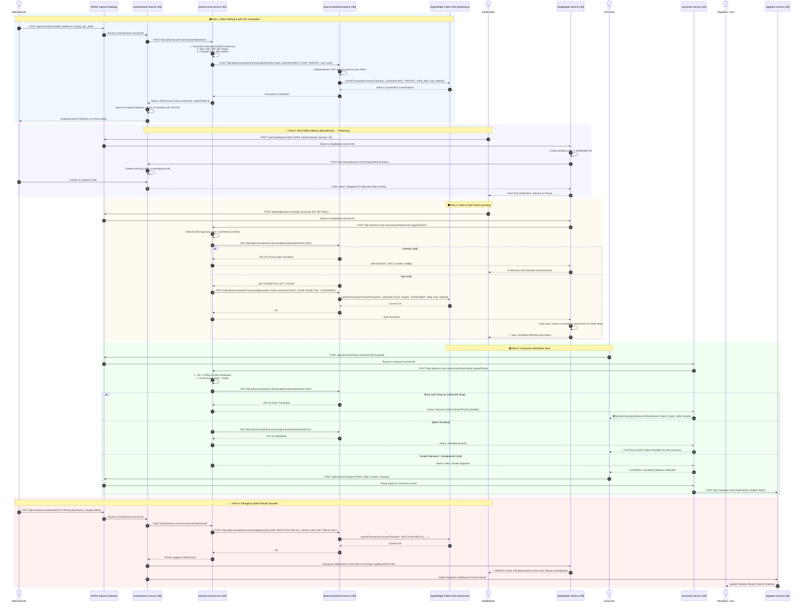

# 🏥 PharmaChain — Single Source of Truth
### Eliminating Fake Medicines from India Using Blockchain + AI/ML

> **Document Purpose**: This is the **single source of truth** for the entire team.
> It covers every problem we are solving, every idea we have discussed, what is already solved,
> what government is working on, what is still open, and what we ship in V1.
> **Every team member must read this before writing a single line of code.**

---

## 🗂️ Document Index

| Section | What it covers |
|---|---|
| [§1 — Problem Landscape](#1-problem-landscape) | All the problems we are solving, flagged by status |
| [§2 — System Architecture](#2--system-architecture--the-kubernetes--ingress-microservice-platform) | Kubernetes, Skaffold, and NGINX Ingress microservice platform |
| [§3 — The Supply Chain Flow](#3-the-supply-chain-flow--eliminating-the-middleman) | Full chain from manufacturer → consumer, incl. direct ordering |
| [§4 — Application Breakdown](#4-application-breakdown) | What each app does (Manufacturer, Shopkeeper, Consumer, Regulator) |
| [§5 — Blockchain Architecture](#5-blockchain-architecture) | How and why we use blockchain |
| [§6 — AI/ML Layer](#6-aiml-layer) | How AI/ML eliminates fake medicines |
| [§7 — Government & Regulatory Landscape](#7-government--regulatory-landscape) | What govt has done, is doing, still needs to do |
| [§8 — Anomaly Detection Engine](#8-anomaly-detection-engine) | Fraud signals and detection pipeline |
| [§9 — Government Awareness Program](#9-government-awareness-program) | Behavior change campaign design |
| [§10 — Open Problems & Ideas](#10-open-problems--ideas-still-to-solve) | What we have not solved yet |
| [§11 — V1 Scope](#11-v1-what-we-actually-ship) | Exact scope for V1 / hackathon demo |
| [§12 — Judge Q&A Prep](#12-judge-qa-pre-answers) | Pre-answered hard questions |
| [§13 — Team Ownership](#13-team-ownership) | Who owns what |
| [§14 — Cryptography & Identity](#14-cryptography--identity) | Signing scheme, QR payload, two-tier verification |
| [§15 — State Machine](#15-state-machine) | Pack lifecycle states and server-side enforcement rules |
| [§16 — Ledger Service Strategy](#16-ledger-service-strategy) | Stub-first approach, chain choice decision |
| [§17 — Data Storage Strategy](#17-data-storage-strategy) | Lazy record creation, schema split |
| [§18 — Merkle Trees](#18-merkle-trees--batch--shipment-verification) | Batch-level and shipment-level Merkle anchoring |
| [§19 — SMS Fallback Channel](#19-sms-fallback-channel) | Short code design, HMAC checksum, Mobile Seva |
| [§20 — Loopholes & Mitigations](#20-loopholes--mitigations) | Known architectural weaknesses and how we address them |
| [§21 — Open Decisions](#21-open-decisions--todos) | Unresolved choices blocking implementation |

---

## §1 — Problem Landscape

> **Legend for problem status tags:**
> - 🔴 `UNSOLVED` — No existing solution, we are building this
> - 🟡 `GOVT WORKING ON IT` — Government has started, not complete
> - 🟢 `PARTIALLY SOLVED` — Some solution exists but gaps remain
> - ✅ `SOLVED` — Complete solution exists (by us or already in market)
> - 💡 `IDEA` — Proposed, not yet committed to building

---

### 1.1 Core Fake Medicine Problems

| # | Problem | Status | Notes |
|---|---|---|---|
| P-01 | Fully counterfeit packs — manufactured with no legitimate origin | 🔴 `UNSOLVED` | Our blockchain registry + manufacturer QR issuance closes this |
| P-02 | Genuine QR code copied onto a fake/different box (relabeling) | 🔴 `UNSOLVED` | OCR physical-box verification in consumer app (§6.2) |
| P-03 | Genuine code resold after first sale ("already sold" code reuse) | 🔴 `UNSOLVED` | State machine: one-time `Sold` flag with timestamp + location |
| P-04 | Expired medicine sold as in-date | 🟢 `PARTIALLY SOLVED` | Expiry printed on pack; our system cross-checks against DB expiry |
| P-05 | Recalled batch still on shelves — no real-time alert mechanism | 🔴 `UNSOLVED` | Push recall cascade to every shop holding the batch (§4.2.5) |
| P-06 | Fake version of a legitimate drug (same name, wrong formulation) | 🔴 `UNSOLVED` | OCR + batch-level formulation record verification |
| P-07 | Unregistered/unlicensed sellers distributing medicine | 🟡 `GOVT WORKING ON IT` | KYC-gated onboarding; CDSCO licensing check |
| P-08 | Distributor/middleman as opaque black box in the supply chain | 🔴 `UNSOLVED` | Direct manufacturer-to-shop ordering (§3) eliminates need in many cases |
| P-09 | Shopkeepers have no incentive to scan every pack | 🔴 `UNSOLVED` | Give them a free inventory system as a byproduct of scanning (§4.2) |
| P-10 | Consumers don't know they should verify medicine | 🔴 `UNSOLVED` | Government awareness program + ASHA workers + POS signage (§9) |
| P-11 | No real-time national counterfeit heatmap for regulators | 🔴 `UNSOLVED` | Regulator console with live district-level anomaly map (§4.4) |
| P-12 | Small pharmacies have no digital stock management → resist adoption | 🔴 `UNSOLVED` | Shopkeeper app IS the inventory system (§4.2) |
| P-13 | Fraud at distributor level (diverting subsidized/govt medicines) | 🟡 `GOVT WORKING ON IT` | Our dispatch manifest + scan trail partially closes this |
| P-14 | Medicines sold without prescriptions (scheduled drugs) | 🟡 `GOVT WORKING ON IT` | Future integration with e-prescription |
| P-15 | No paperless purchase/sale register for pharmacies | 🔴 `UNSOLVED` | Auto-generated register as byproduct of scan events (§4.2.4) |
| P-16 | Rural/low-literacy consumers cannot use smartphone-only app | 🔴 `UNSOLVED` | SMS/USSD/IVR fallback verification (§9) |
| P-17 | Jan Aushadhi medicines lack public-facing verification | 🟡 `GOVT WORKING ON IT` | Pilot our system there first — govt already owns this chain |

---

### 1.2 Supply Chain Transparency Problems

| # | Problem | Status | Notes |
|---|---|---|---|
| S-01 | No end-to-end traceability from manufacturer → consumer | 🔴 `UNSOLVED` | Core blockchain ledger solves this |
| S-02 | Batch recall takes days/weeks to reach all retailers | 🔴 `UNSOLVED` | Real-time push recall cascade (§4.2.5, §4.3.2) |
| S-03 | Manufacturers have no visibility into where their products end up | 🟢 `PARTIALLY SOLVED` | Manufacturer anomaly dashboard scoped to their own batches (§4.3) |
| S-04 | No way for a shopkeeper to order directly from manufacturer | 🔴 `UNSOLVED` | **Direct Order Module** — our new feature (§3, §4.3.3) |
| S-05 | Middlemen (distributors/C&F agents) add cost and opacity | 🔴 `UNSOLVED` | Direct ordering eliminates middleman for adopting shops (§3.2) |
| S-06 | Shopkeeper cannot track which manufacturer/batch a delivery came from | 🟢 `PARTIALLY SOLVED` | Batch-linked AtShop scan + manufacturer dispatch manifest |

---

## §2 — System Architecture — The Kubernetes & Ingress Microservice Platform

> **Core Architectural Principle**: The platform is built as an enterprise-grade, cloud-native **Kubernetes (K8s) Microservices Architecture** orchestrated with **Skaffold** for zero-friction local development and hot-reloading.
>
> External client traffic enters through a **Single Shared NGINX Ingress Controller** (`k8s/ingress.yml`) that performs path-based routing to domain microservices.
> 
> All cryptographic key vaults, JWT signing operations, and Hyperledger Fabric blockchain gateways reside within **isolated, internal ClusterIP services** completely shielded from external ingress exposure.

```mermaid
flowchart TB

    %% ============================================================
    %% GLOBAL STYLES
    %% ============================================================
    classDef client fill:#e1f5fe,stroke:#0288d1,stroke-width:2px,color:#01579b;
    classDef ingress fill:#fff3e0,stroke:#f57c00,stroke-width:2px,color:#e65100;
    classDef service fill:#e8eaf6,stroke:#3f51b5,stroke-width:2px,color:#1a237e;
    classDef database fill:#ede7f6,stroke:#673ab7,stroke-width:2px,color:#311b92;
    classDef security fill:#e0f2f1,stroke:#00897b,stroke-width:2px,color:#004d40;
    classDef gateway fill:#fffde7,stroke:#fbc02d,stroke-width:2px,color:#f57f17;
    classDef blockchain fill:#fbe9e7,stroke:#ff5722,stroke-width:2px,color:#bf360c;
    classDef storage fill:#efebe9,stroke:#6d4c41,stroke-width:2px,color:#3e2723;
    classDef external fill:#f5f5f5,stroke:#616161,stroke-width:2px,color:#212121;


    %% ============================================================
    %% 1. USER / CLIENT LAYER
    %% ============================================================
    subgraph CLIENTS["🌐 CLIENT & APPLICATION LAYER"]

        Manufacturer["🏢 Manufacturer Portal
        React 18 + Vite
        • Batch Minting
        • QR Generation
        • Recall Management"]:::client

        Pharmacy["🏪 Pharmacy Smart POS
        React Native / Web
        • QR Scanner
        • POS Checkout
        • B2B Ordering"]:::client

        Consumer["👤 Consumer Mobile App
        React Native
        • QR Scanner
        • Offline Verification
        • Fraud Reporting"]:::client

        Regulator["🏛️ Regulator Console
        React Analytics
        • Counterfeit Heatmap
        • Batch Audit
        • Report Triage"]:::client
    end


    %% ============================================================
    %% 2. EDGE / INGRESS
    %% ============================================================
    subgraph EDGE["🚪 PUBLIC EDGE"]

        Ingress["NGINX Kubernetes Ingress
        Port 80 / 443
        • TLS Termination
        • Path Routing
        • Rate Limiting
        • Request Timeouts"]:::ingress

        CertManager["🔐 Cert-Manager
        TLS Certificates"]:::external

        CertManager -.-> Ingress
    end


    %% ============================================================
    %% 3. KUBERNETES APPLICATION CLUSTER
    %% ============================================================
    subgraph K8S["☸️ KUBERNETES APPLICATION CLUSTER"]

        %% ---------------- Manufacturer ----------------
        subgraph MFR["Manufacturer Domain"]

            MfrSvc["manufacturer-service
            Node.js / Express
            :3001
            • Batch Management
            • QR Generation
            • Order Dispatch"]:::service

            MfrDB[("PostgreSQL 16
            manufacturer-db
            • users
            • batches
            • packs
            • orders")]:::database

            MfrSvc --> MfrDB
        end


        %% ---------------- Shopkeeper ----------------
        subgraph SHOP["Pharmacy / Shopkeeper Domain"]

            ShopSvc["shopkeeper-service
            Node.js / Express
            :3002
            • POS Sales
            • QR Verification
            • Inventory
            • B2B Orders"]:::service

            ShopDB[("PostgreSQL 16
            shopkeeper-db
            • pharmacies
            • stock
            • pack_events
            • orders")]:::database

            ShopSvc --> ShopDB
        end


        %% ---------------- Consumer ----------------
        subgraph CONSUMER["Consumer Domain"]

            ConsumerSvc["consumer-service
            Node.js / Express
            :3003
            • Verification Router
            • Fraud Reports"]:::service
        end


        %% ---------------- Regulator ----------------
        subgraph REG["Regulator & AI Domain"]

            RegulatorSvc["regulator-service
            Node.js / Express
            :3005
            • Fraud Analytics
            • Heatmap Aggregation
            • Audit Feeds"]:::service

            RegulatorDB[("MongoDB 7
            regulator-db
            • fraud_reports
            • audit_logs
            • heatmaps")]:::database

            RegulatorSvc --> RegulatorDB
        end


        %% ========================================================
        %% INTERNAL SECURITY DOMAIN
        %% ========================================================
        subgraph SECURITY["🔒 INTERNAL SECURITY ZONE"]

            Core["🛡️ pharma-core-service
            Node.js Security Vault
            :4000

            • ES256 Key Generation
            • JWT Signing
            • SHA-256 Hashing
            • Signature Verification
            • Encrypted Keystore
            • JWKS Endpoint

            🚫 NO PUBLIC INGRESS"]:::security

            KeyStore[("🔐 AES-256-GCM
            Encrypted Key Store")]:::storage

            Core --> KeyStore
        end


        %% ========================================================
        %% BLOCKCHAIN GATEWAY
        %% ========================================================
        subgraph BLOCK_GATEWAY["⛓️ INTERNAL BLOCKCHAIN GATEWAY"]

            Backend["☕ pharma-backend-service
            Spring Boot
            :8080

            • Fabric Gateway SDK
            • gRPC / Netty
            • mTLS
            • OAuth2 Resource Server
            • JWT Validation

            🚫 NO PUBLIC INGRESS"]:::gateway

            Crypto["🔑 Fabric MSP Crypto Material
            /crypto/users/.../msp"]:::storage

            Backend --> Crypto
        end

    end


    %% ============================================================
    %% 4. HYPERLEDGER FABRIC NETWORK
    %% ============================================================
    subgraph FABRIC["🔗 HYPERLEDGER FABRIC NETWORK"]

        %% ---------------- Org 1 ----------------
        subgraph ORG1["Organization 1
        Pharma Regulators / Manufacturers"]

            Peer1["🖥️ peer0.org1
            :7051
            • Endorsement
            • Chaincode
            • Commit"]:::blockchain

            Couch1[("🛋️ CouchDB
            World State")]:::storage

            Ledger1[("📦 Immutable BlockStore
            Cryptographic Block Chain")]:::storage

            Peer1 --> Couch1
            Peer1 --> Ledger1
        end


        %% ---------------- Org 2 ----------------
        subgraph ORG2["Organization 2
        Distributors / Pharmacy Council"]

            Peer2["🖥️ peer0.org2
            :9051
            • Endorsement
            • Chaincode
            • Commit"]:::blockchain

            Couch2[("🛋️ CouchDB
            World State")]:::storage

            Ledger2[("📦 Immutable BlockStore")]:::storage

            Peer2 --> Couch2
            Peer2 --> Ledger2
        end


        %% ---------------- Orderer ----------------
        subgraph ORDERING["Raft Ordering Cluster"]

            Orderer["🏛️ Fabric Orderer
            :7050

            • Raft Consensus
            • Transaction Ordering
            • Block Creation
            • Block Distribution"]:::blockchain
        end
    end


    %% ============================================================
    %% CLIENT → EDGE
    %% ============================================================

    Manufacturer -->|"HTTPS"| Ingress
    Pharmacy -->|"HTTPS"| Ingress
    Consumer -->|"HTTPS"| Ingress
    Regulator -->|"HTTPS"| Ingress


    %% ============================================================
    %% EDGE → DOMAIN SERVICES
    %% ============================================================

    Ingress -->|"/api/manufacturer"| MfrSvc
    Ingress -->|"/api/shopkeeper"| ShopSvc
    Ingress -->|"/api/consumer"| ConsumerSvc
    Ingress -->|"/api/regulator"| RegulatorSvc


    %% ============================================================
    %% DOMAIN SERVICES → SECURITY CORE
    %% ============================================================

    MfrSvc -->|"Mint / Sign QR"| Core
    ShopSvc -->|"Verify Signature / Hash"| Core
    ConsumerSvc -->|"Verify Authenticity"| Core
    RegulatorSvc -->|"Security / Audit Operations"| Core


    %% ============================================================
    %% CORE → BLOCKCHAIN GATEWAY
    %% ============================================================

    Core -->|"Authenticated REST
    /api/transition
    Bearer JWT"| Backend

    Backend -.->|"JWKS Public Key
    /.well-known/jwks.json"| Core


    %% ============================================================
    %% BLOCKCHAIN GATEWAY → FABRIC
    %% ============================================================

    Backend -->|"gRPC + mTLS
    Endorsement Proposal"| Peer1

    Backend -->|"gRPC + mTLS
    Endorsement Proposal"| Peer2

    Backend -->|"Broadcast
    Endorsed Transaction"| Orderer


    %% ============================================================
    %% FABRIC CONSENSUS / BLOCK DISTRIBUTION
    %% ============================================================

    Peer1 -->|"Proposal Response"| Backend
    Peer2 -->|"Proposal Response"| Backend

    Orderer -->|"New Block"| Peer1
    Orderer -->|"New Block"| Peer2


    %% ============================================================
    %% OPTIONAL SERVICE-TO-SERVICE COMMUNICATION
    %% ============================================================

    MfrSvc -.->|"Internal REST"| ShopSvc
    ShopSvc -.->|"Internal REST"| MfrSvc
    ConsumerSvc -.->|"Fraud Report"| RegulatorSvc


    %% ============================================================
    %% TRUST BOUNDARIES
    %% ============================================================

    style CLIENTS fill:#f8fdff,stroke:#0288d1,stroke-width:2px
    style EDGE fill:#fffaf2,stroke:#f57c00,stroke-width:2px
    style K8S fill:#f7f7ff,stroke:#3f51b5,stroke-width:3px
    style SECURITY fill:#f0fffc,stroke:#00897b,stroke-width:2px
    style BLOCK_GATEWAY fill:#fffef2,stroke:#fbc02d,stroke-width:2px
    style FABRIC fill:#fff8f6,stroke:#ff5722,stroke-width:3px
```



---

### 2.1 Service Inventory Matrix (Bounded Contexts & Isolation)

Aligned with the **`microservice-readme-architect`** standard:

| Microservice | Internal K8s DNS Name | Target Port | Ingress Path | Database | Bounded Context Responsibility | Ingress Accessible? |
|---|---|:---:|---|---|---|:---:|
| **`manufacturer-service`** | `manufacturer-service:80` | `3001` | `/api/manufacturer` | Postgres (`manufacturer-db`) | Manufacturer registration/KYC, batch creation, QR code generation, downloadable CSV export, direct order management. | ✅ Public |
| **`shopkeeper-service`** | `shopkeeper-service:80` | `3002` | `/api/shopkeeper` | Postgres (`shopkeeper-db`) | Pharmacy registration, POS sale scans, on-shelf stock inventory tracking, direct B2B order placement to manufacturers. | ✅ Public |
| **`consumer-service`** | `consumer-service:80` | `3003` | `/api/consumer` | None (Stateless) | Public consumer scan verification, medicine authenticity queries, suspicious pack reporting. | ✅ Public |
| **`regulator-service`** | `regulator-service:80` | `3005` | `/api/regulator` | Mongo (`regulator-db`) | National counterfeit heatmap aggregation, batch audit trail inspection, consumer report triage queue. | ✅ Public |
| **`pharma-core`** | `pharma-core-service:80` | `4000` | *None* | Keystore (Encrypted at rest) | **Root Security Vault**: Holds encrypted ES256 manufacturer keys, signs JWT QR payloads, computes SHA-256 pack hashes, hosts `GET /.well-known/jwks.json`. | ❌ **Internal Only** |
| **`pharma-backend`** | `pharma-backend-service:80` | `8080` | *None* | In-Memory Gateway | **Fabric Gateway**: Spring Boot 4.1.0 wrapper executing Fabric SDK proposals over gRPC mTLS. Verifies incoming JWTs against `pharma-core`'s JWKS. | ❌ **Internal Only** |
| **`pharmacc`** | — | — | *None* | CouchDB + BlockStore | **Immutable Transition Ledger**: Stores `{ hash, fromId, toId, sellingDate, sellingTime, sellerId }`. | ❌ **Internal Only** |

---

### 2.2 Monorepo Directory & Kubernetes Manifest Structure

Standardized against the **`k8s-skaffold-yaml-guide`**:

```
SIH_2026/                                 ← Monorepo Root
├── skaffold.yml                          ← Single Skaffold config for ALL services
├── k8s/                                  ← ALL Kubernetes manifests live here (flat structure)
│   ├── ingress.yml                       ← ONE shared NGINX ingress routing all services
│   ├── secrets.yml                       ← Multi-document YAML (database, jwt, fabric certs)
│   ├── secrets.yml.example               ← Committed safe template with placeholder values
│   ├── manufacturer.deployment.yml
│   ├── manufacturer.service.yml
│   ├── shopkeeper.deployment.yml
│   ├── shopkeeper.service.yml
│   ├── consumer.deployment.yml
│   ├── consumer.service.yml
│   ├── regulator.deployment.yml
│   ├── regulator.service.yml
│   ├── pharma-core.deployment.yml
│   ├── pharma-core.service.yml
│   ├── pharma-backend.deployment.yml
│   └── pharma-backend.service.yml
│
├── Manufacturer/                         ← Microservice directory
│   ├── dockerfile                        ← Lowercase "dockerfile" (node:20-alpine)
│   ├── package.json
│   └── src/
│
├── Shopkeeper/
│   ├── dockerfile
│   └── src/
│
├── Consumer/
│   ├── dockerfile
│   └── src/
│
├── Pharma-core/
│   ├── dockerfile
│   └── src/
│
├── Backend/                              ← Spring Boot Fabric Gateway (pharma-backend)
│   ├── dockerfile                        ← Multi-stage or Gradle JRE container
│   ├── build.gradle
│   └── src/
│
└── chaincode/                            ← Java Chaincode (pharmacc)
    └── src/main/java/org/hyperledger/fabric/samples/assettransfer/
```

---

### 2.3 Shared Ingress Specification (`k8s/ingress.yml`)

```yaml
apiVersion: networking.k8s.io/v1
kind: Ingress
metadata:
  name: pharmachain-ingress
  labels:
    app.kubernetes.io/name: pharmachain-ingress
  annotations:
    nginx.ingress.kubernetes.io/proxy-read-timeout: "300"
    nginx.ingress.kubernetes.io/proxy-send-timeout: "300"
    nginx.ingress.kubernetes.io/proxy-connect-timeout: "10"
    nginx.ingress.kubernetes.io/use-regex: "true"
spec:
  ingressClassName: nginx
  rules:
    - http:
        paths:
          - pathType: Prefix
            path: "/api/manufacturer"
            backend:
              service:
                name: manufacturer-service
                port:
                  number: 80

          - pathType: Prefix
            path: "/api/shopkeeper"
            backend:
              service:
                name: shopkeeper-service
                port:
                  number: 80

          - pathType: Prefix
            path: "/api/consumer"
            backend:
              service:
                name: consumer-service
                port:
                  number: 80

          - pathType: Prefix
            path: "/api/regulator"
            backend:
              service:
                name: regulator-service
                port:
                  number: 80
```

> **Security Rule**: Notice that `pharma-core-service` and `pharma-backend-service` are **omitted** from `ingress.yml`. They can only be reached from inside the Kubernetes cluster via internal DNS (`http://pharma-core-service` and `http://pharma-backend-service`).

---

### 2.4 Skaffold Configuration (`skaffold.yml`)

```yaml
apiVersion: skaffold/v4beta2
kind: Config

build:
  tagPolicy:
    sha256: {}          # ALWAYS sha256 for consistent local Docker daemon tracking
  artifacts:
    - image: manufacturer-service
      context: Manufacturer
      docker:
        dockerfile: dockerfile
      sync:
        infer:
          - "src/**"

    - image: shopkeeper-service
      context: Shopkeeper
      docker:
        dockerfile: dockerfile
      sync:
        infer:
          - "src/**"

    - image: consumer-service
      context: Consumer
      docker:
        dockerfile: dockerfile
      sync:
        infer:
          - "src/**"

    - image: pharma-core-service
      context: Pharma-core
      docker:
        dockerfile: dockerfile
      sync:
        infer:
          - "src/**"

    - image: pharma-backend-service
      context: Backend
      docker:
        dockerfile: dockerfile

manifests:
  rawYaml:
    - k8s/secrets.yml
    - k8s/ingress.yml
    - k8s/manufacturer.deployment.yml
    - k8s/manufacturer.service.yml
    - k8s/shopkeeper.deployment.yml
    - k8s/shopkeeper.service.yml
    - k8s/consumer.deployment.yml
    - k8s/consumer.service.yml
    - k8s/pharma-core.deployment.yml
    - k8s/pharma-core.service.yml
    - k8s/pharma-backend.deployment.yml
    - k8s/pharma-backend.service.yml
```

---

### 2.5 Standardized Deployment Pattern (`k8s/*.deployment.yml`)

Every Node.js microservice follows this standard template:

```yaml
apiVersion: apps/v1
kind: Deployment
metadata:
  name: manufacturer-deployment
  labels:
    app: manufacturer
spec:
  replicas: 1
  selector:
    matchLabels:
      app: manufacturer
  template:
    metadata:
      labels:
        app: manufacturer
    spec:
      containers:
      - name: manufacturer-container
        image: manufacturer-service
        imagePullPolicy: IfNotPresent
        resources:
          requests:
            cpu: "250m"
            memory: "128Mi"
          limits:
            cpu: "500m"
            memory: "256Mi"
        livenessProbe:
          httpGet:
            path: /healthz
            port: 3001
          initialDelaySeconds: 30
          periodSeconds: 10
          timeoutSeconds: 5
        readinessProbe:
          httpGet:
            path: /readyz
            port: 3001
          initialDelaySeconds: 15
          periodSeconds: 5
          timeoutSeconds: 5
        ports:
        - containerPort: 3001
          name: mfr-http
        env:
        - name: PORT
          value: "3001"
        - name: PHARMA_CORE_URL
          value: "http://pharma-core-service"
        - name: DATABASE_URL
          valueFrom:
            secretKeyRef:
              name: database-secret
              key: MANUFACTURER_DB_URL
        - name: JWT_SECRET
          valueFrom:
            secretKeyRef:
              name: jwt-secret
              key: MFR_JWT_SECRET
```

---

### 2.6 Standardized Service Pattern (`k8s/*.service.yml`)

Every service exposes cluster-internal **port 80** mapping to its specific `containerPort`:

```yaml
kind: Service
apiVersion: v1
metadata:
  name: manufacturer-service
  labels:
    app: manufacturer
spec:
  selector:
    app: manufacturer
  type: ClusterIP
  ports:
  - name: mfr-http
    port: 80
    targetPort: 3001
```

---

### 2.7 Complete End-to-End Operational Lifecycle Flows



---

### 2.8 Comprehensive Detailed Operational Flowchart

The following flowchart maps out every decision point, validation rule, cryptographic check, database update, and blockchain transaction across all services in the system:

```mermaid
flowchart TD
    %% Styling Classes
    classDef startNode fill:#e1f5fe,stroke:#0288d1,stroke-width:2px,color:#01579b;
    classDef decisionNode fill:#fff9c4,stroke:#fbc02d,stroke-width:2px,color:#f57f17;
    classDef successNode fill:#e8f8f5,stroke:#2ecc71,stroke-width:2px,color:#27ae60;
    classDef dangerNode fill:#fdebd0,stroke:#e74c3c,stroke-width:2px,color:#c0392b;
    classDef k8sNode fill:#e8eaf6,stroke:#3f51b5,stroke-width:2px,color:#1a237e;
    classDef dbNode fill:#ede7f6,stroke:#673ab7,stroke-width:2px,color:#311b92;
    classDef chainNode fill:#fbe9e7,stroke:#ff5722,stroke-width:2px,color:#bf360c;

    %% ─────────────────────────────────────────────────────────────
    %% WORKFLOW 1: BATCH MINTING & QR GENERATION
    %% ─────────────────────────────────────────────────────────────
    subgraph WF1 ["🟢 Workflow 1: Manufacturer Batch Minting & QR Generation"]
        M1([🏢 Manufacturer Web App]):::startNode --> M2[Fill Batch Form: Medicine, Expiry, Qty: N]
        M2 --> M3[POST /api/manufacturer/batch via Ingress]:::k8sNode
        M3 --> M4[manufacturer-service :80]:::k8sNode
        M4 --> M5[Call internal pharma-core-service /core/batch/mint]:::k8sNode
        M5 --> M6[1. Decrypt ES256 Private Key<br/>2. Loop 1..N: Sign JWT QR Tokens<br/>3. Compute packHash = SHA256 JWT]
        M6 --> M7[Call pharma-backend-service POST /api/transition]:::chainNode
        M7 --> M8[Fabric Peer: submitTransaction recordTransition packHash:MFG]:::chainNode
        M8 --> M9[(Write State to CouchDB & Fabric Block)]:::dbNode
        M9 --> M10[manufacturer-service saves Batch & Packs in Postgres]:::dbNode
        M10 --> M11[Generate QR Code Images & Export CSV / ZIP]
        M11 --> M12([📥 Download Printable QR Sheet]):::successNode
    end

    %% ─────────────────────────────────────────────────────────────
    %% WORKFLOW 2: DIRECT B2B ORDERING
    %% ─────────────────────────────────────────────────────────────
    subgraph WF2 ["🔵 Workflow 2: Direct B2B Ordering (Eliminating Middlemen)"]
        O1([🏪 Pharmacy POS App]):::startNode --> O2[Browse Manufacturer Catalog & Select Qty]
        O2 --> O3[POST /api/shopkeeper/orders via Ingress]:::k8sNode
        O3 --> O4[shopkeeper-service creates Pending Order in Postgres]:::dbNode
        O4 --> O5[Notify manufacturer-service of Incoming Order]:::k8sNode
        O5 --> O6{Manufacturer Approves Order?}:::decisionNode
        O6 -- Yes --> O7[Pre-allocate Batch Serials & Mark Shipped]
        O7 --> O8[Push Notification to Pharmacy: Stock En Route]:::successNode
        O6 -- No --> O9[Order Rejected & Pharmacy Notified]:::dangerNode
    end

    %% ─────────────────────────────────────────────────────────────
    %% WORKFLOW 3: POINT-OF-SALE SCAN & SALE RECORDING
    %% ─────────────────────────────────────────────────────────────
    subgraph WF3 ["🟠 Workflow 3: Point-of-Sale (POS) Checkout & Sale Recording"]
        S1([🛒 Pharmacist Scans Pack QR Code]):::startNode --> S2[POST /api/shopkeeper/scan/sale via Ingress]:::k8sNode
        S2 --> S3[shopkeeper-service calls pharma-core /core/hash/verify]:::k8sNode
        S3 --> S4{1. Tier-1 Signature Valid?}:::decisionNode
        S4 -- Invalid / Forged --> S5[🛑 REJECT SALE: Forged or Fake QR Code Detected]:::dangerNode
        S4 -- Valid ES256 --> S6{2. Expiry Date < Today?}:::decisionNode
        S6 -- Expired --> S7[⚠️ REJECT SALE: Expired Medicine. Pull From Shelf]:::dangerNode
        S6 -- In Date --> S8[Query pharma-backend for packHash:SALE on Fabric]:::chainNode
        S8 --> S9{3. Already Sold on Ledger?}:::decisionNode
        S9 -- Yes Found --> S10[⚠️ REJECT SALE: HTTP 409 Double-Sale. Pack Already Sold!]:::dangerNode
        S9 -- Not Found 404 --> S11[Submit recordTransition packHash:SALE to Fabric]:::chainNode
        S11 --> S12[(Commit Sale Event to Blockchain Ledger)]:::dbNode
        S12 --> S13[shopkeeper-service decrements On-Shelf Stock in Postgres]:::dbNode
        S13 --> S14([✅ Sale Approved & Receipt Printed]):::successNode
    end

    %% ─────────────────────────────────────────────────────────────
    %% WORKFLOW 4: CONSUMER VERIFICATION SCAN
    %% ─────────────────────────────────────────────────────────────
    subgraph WF4 ["🟣 Workflow 4: Consumer Scan, Verification & Fraud Reporting"]
        C1([👤 Consumer Scans Medicine QR Code]):::startNode --> C2[POST /api/consumer/verify via Ingress]:::k8sNode
        C2 --> C3[consumer-service calls pharma-core-service]:::k8sNode
        C3 --> C4{1. Tier-1 Offline ES256 Check}:::decisionNode
        
        C4 -- Invalid Signature --> C5[🔴 DANGER: Counterfeit Medicine Detected!]:::dangerNode
        C5 --> C6[Prompt Consumer to Submit Fraud Report with Photo & Location]
        C6 --> C7[POST /api/consumer/report to regulator-service]:::k8sNode
        C7 --> C8[(Store Incident in regulator-events MongoDB)]:::dbNode

        C4 -- Valid Signature --> C9{2. Check Expiry Date}:::decisionNode
        C9 -- Expired --> C10[⚠️ WARNING: Medicine is Expired. Do Not Consume!]:::dangerNode
        C9 -- In Date --> C11[Query Fabric for Batch Recall & Pack Sale State]:::chainNode
        
        C11 --> C12{3. Batch Recalled?}:::decisionNode
        C12 -- Yes --> C13[🛑 CRITICAL ALERT: Batch Recalled by Manufacturer!]:::dangerNode
        C12 -- No --> C14{4. Pack Sale Status?}:::decisionNode
        
        C14 -- Sold Today at this Shop --> C15[🟢 VERIFIED GENUINE: Safe to Consume<br/>(Shows Mfr, Batch, Expiry, Seller Details)]:::successNode
        C14 -- Sold in Past / Diff Shop --> C16[⚠️ WARNING: Code previously sold. Suspected Duplicate/Clone!]:::dangerNode
        C14 -- Unsold / AtShop --> C17[ℹ️ Genuine Packaged Stock]:::successNode
    end

    %% ─────────────────────────────────────────────────────────────
    %% WORKFLOW 5: EMERGENCY RECALL CASCADE
    %% ─────────────────────────────────────────────────────────────
    subgraph WF5 ["🔴 Workflow 5: Real-Time Emergency Batch Recall Cascade"]
        R1([🏭 Manufacturer Discovers Quality Defect]):::startNode --> R2[POST /api/manufacturer/batch/:id/recall]:::k8sNode
        R2 --> R3[pharma-core submits BATCH:RECALL to Fabric]:::chainNode
        R3 --> R4[(Immutably Log Recall on Blockchain Ledger)]:::dbNode
        R4 --> R5[Broadcast Instant WebSocket / Push Alerts to all Registered Pharmacies]:::k8sNode
        R5 --> R6([🚨 Pharmacy POS Alerts: Pull Batch From Shelves Immediately]):::dangerNode
        R4 --> R7[Update National Regulator Counterfeit & Recalls Heatmap]:::k8sNode
    end
```

---

## §3 — The Supply Chain Flow — Eliminating the Middleman

### 3.1 Traditional Chain (What We Are Replacing / Complementing)

```
Manufacturer → C&F Agent → Stockist/Distributor → Retailer/Pharmacy → Consumer
     ↑ (opacity here)             ↑ (opacity here)
  No tracking                No real-time tracking
  No recall cascade           No recall cascade
  Price markup ×2–3x          Price markup ×1.5–2x
```

**Problems with this chain:**
- Every handoff is a potential point of diversion, duplication, or substitution
- A recall at manufacturer level takes 1–3 weeks to reach all pharmacies
- Shopkeeper does not know provenance of what they received
- Consumer has zero visibility

### 3.2 New Chain — Direct Manufacturer-to-Shop (For Adopting Shops)

```
Manufacturer App ──[Direct Order]──► Shopkeeper App
      │                                    │
      │  1. Shopkeeper places order        │
      │     (medicine, quantity, address)  │
      │                                    │
      │  2. Manufacturer reviews &         │
      │     confirms in their app          │
      │                                    │
      │  3. Manufacturer ships +           │
      │     logs dispatch on platform      │
      │                                    │
      │  4. Shopkeeper scans batch on      │
      │     arrival → AtShop event         │
      │     → stock auto-populated         │
      │                                    │
      └────────────────────────────────────┘
```

**Benefits of direct ordering:**
- Eliminates 1–2 levels of intermediaries → **cost saving for shopkeeper**
- Every pack's origin is provably linked to the manufacturer who produced it
- Recall cascade is instant and complete — manufacturer knows exactly which shops have which batches
- Shopkeeper gets competitive pricing; manufacturer gets market intelligence on demand
- Middle layer (C&F/distributor) is not eliminated by force — they become **optional** for shops that choose to go direct

### 3.3 Hybrid Chain — Traditional + Platform (Realistic V1)

For shops that still use distributors:

```
Manufacturer → Distributor → [Shopkeeper scans AtShop] → [Consumer scans Sold]
```

The platform does not require the distributor to be on-platform. The shopkeeper's `AtShop` scan is still the anchor. We miss the manufacturer→distributor leg traceability in this scenario — this is a known gap (see §10 open problems).

---

## §4 — Application Breakdown

---

### 4.1 Consumer App

**Goal**: Make it effortless for any consumer to verify any medicine in under 10 seconds.

#### 4.1.1 Scan & Verify — Full Status Table

| System finds... | Consumer sees |
|---|---|
| Valid token, first Sold event, timestamp = today | ✅ **Genuine — verified at time of purchase.** Manufacturer, batch, mfg/expiry, seller name & license shown. |
| Valid token, Sold timestamp is weeks/months old or at a different shop | ⚠️ **This code was already marked sold on [date] at [shop/location].** May be a duplicate — use "Report suspicious." |
| Valid token, status = `Packaged` (never reached any registered shop) | ⚠️ **This code has never checked into any registered shop.** Likely a cloned code — do not consume. |
| Token not found at all | 🚫 **This pack was never registered.** Strong signal of a fully counterfeit product. |
| Token valid, physical box OCR mismatches the registered medicine/batch | ⚠️ **Box does not match what this code is registered for.** [Registered: medicine A / batch X] vs [Your box: medicine B / batch Y]. Relabeling red flag. |
| Status = `Recalled` | ⚠️ **This batch has been recalled — do not consume.** [Reason if available.] |
| Status = `ExpiredFlagged` or computed expiry has passed | ⚠️ **This pack is past its expiry date.** |
| Seller KYC not verified | ⚠️ **Seller verification could not be confirmed.** Treat with caution. |

#### 4.1.2 OCR Physical-Box Verification (Catches Relabeling — P-02)

1. After QR scan, prompt: *"Take a photo of the medicine name and batch number on your box."*
2. On-device OCR (Google ML Kit / Firebase ML) extracts text from the photo.
3. Compare extracted medicine name + batch number against the registered token record.
4. Mismatch → relabeling warning displayed. Match → normal Genuine display proceeds.

> **Why this matters**: This is the only check that catches a genuine QR on a fake box. No amount of blockchain integrity catches physical-world fraud. This is our strongest technical differentiator.

#### 4.1.3 Other Consumer Features

- **My Medicines** — scan history; retroactive recall notifications if a batch they previously scanned gets recalled later
- **Report Suspicious** — structured tap-to-select categories: wrong medicine in box / seal tampered / price mismatch / adverse reaction / other
- **Seller legitimacy display** — shop name, license number, verification badge from KYC
- **Accessibility**: SMS/USSD fallback (text shortcode → get verdict by SMS), IVR toll-free call, regional language support

---

### 4.2 Shopkeeper App

**Goal**: Be the pharmacy's primary inventory system. Traceability is the free byproduct.
*If the shopkeeper gets independent value from the app, they scan every pack.*

#### 4.2.1 Live Stock Dashboard

Every `AtShop` and `Sold` scan auto-computes:
- **On-shelf count** per medicine/batch = (AtShop scans) − (Sold + Recalled + ExpiredFlagged scans)
- **Today / week / month** sold count by medicine and batch
- **Value of current stock** — optional: enter cost price once per batch

> **This replaces the paper register** most small Indian pharmacies still use. Zero manual counting required.

#### 4.2.2 Expiry-Aging Report

Bucket current stock by days-to-expiry:
- 🔴 < 30 days — one-tap "initiate return to distributor / manufacturer"
- 🟡 30–90 days
- 🟢 > 90 days

Helping the shopkeeper return near-expired stock before it becomes their loss is a **direct rupee saving** — the strongest adoption argument we have.

#### 4.2.3 Reorder Signal

Simple velocity calculation: units sold per week per medicine → flag "reorder soon" when stock falls below ~2 weeks of run rate. Rolling average, no ML needed in V1.

#### 4.2.4 Auto-Generated Compliance Register

Licensed pharmacies must maintain purchase/sale records for scheduled drugs. Since every pack's intake and sale is logged with timestamps, the app generates a downloadable PDF/Excel register for any date range at one tap.

> **Pitch line**: "We did not build a compliance feature. We built an inventory tool that produces their compliance paperwork as a side effect."

#### 4.2.5 Recall Push Alerts

When a batch is flagged `Recalled`:
1. System queries all shops with on-shelf stock from that batch (visible from §4.2.1's running count)
2. Push notification to each shop: "Pull these exact packs. Batch [X], [N] packs on your shelf."
3. Shopkeeper taps to confirm pull → `PullConfirmed` event logged → regulator sees action taken

#### 4.2.6 Direct Ordering from Manufacturer

- Browse registered manufacturers and their available medicines/prices
- Place order: medicine, quantity, delivery address, requested date
- Track order status in-app (Confirmed / Shipped / Delivered)
- On delivery: scan packs → `AtShop` event auto-linked to the order → stock pre-populated

#### 4.2.7 Recall Initiation by Shopkeeper

💡 *Feature idea:* If a shopkeeper notices a problem (wrong tablets in a bottle, seal damaged across multiple packs from the same batch), they can **flag a recall concern** to the manufacturer. The manufacturer reviews and either confirms (triggering full recall cascade) or dismisses with a reason. This creates a bottom-up recall signal that does not currently exist in the system.

#### 4.2.8 Multi-Outlet Roll-Up *(Stretch — Not V1)*

Manager view aggregating stock and sales across multiple pharmacy branches. Important for chains; not required for V1.

---

### 4.3 Manufacturer App

**Goal**: Full control of their product's lifecycle from production to shelf.

#### 4.3.1 Batch & QR Management

- Create batch: medicine name, formulation, batch number, mfg date, expiry date, quantity
- Generate cryptographically signed QR tokens for each pack (one token per pack, never reusable)
- Tokens are registered on blockchain at generation
- Print/export tokens for physical application to packs

#### 4.3.2 Recall Management

- One-tap recall trigger on any batch → cascades instantly to:
  - Every shopkeeper holding that batch (push notification, §4.2.5)
  - Every future consumer scan (shows Recalled status)
  - Regulator console (visible in triage queue)
- Track recall completion: see which shops have confirmed pulling the batch

#### 4.3.3 Direct Order Management *(New — Eliminates Middleman)*

- **Incoming Orders Dashboard**: All orders placed by shopkeepers across the platform
- Per order: shopkeeper details, license verification status, requested medicines, quantity, delivery address
- Confirm / modify / reject order with reason
- Mark order as shipped → auto-logs dispatch event linked to the batch on the platform
- View order history, fulfillment rate, and demand breakdown by shop / region / medicine

> **What this creates**: A direct, traceable, auditable B2B channel between manufacturer and pharmacy — no distributor needed. For shops that adopt this, every pack is provably linked to its manufacturer from the moment it leaves the factory.

#### 4.3.4 Anomaly Dashboard (Scoped to Own Batches)

- Which batches are generating cloned QR reports, mismatch reports, or "not found" scans
- Geographic concentration — which region / distributor / shop is the locus of anomalies
- Trend over time per batch
- This gives manufacturers a **direct commercial incentive** to act: if their batch is being counterfeited in a specific region, they are losing sales there

#### 4.3.5 Dispatch Manifest (for Traditional Distribution)

For orders going through distributors (not direct):
"Batch X dispatched to Distributor Y on Date Z — Quantity N packs."
Single metadata field logged on the platform. Does not track custody through the distributor but creates an anchor point for the traceability chain.

---

### 4.4 Regulator / Government Console

**Goal**: Real-time intelligence dashboard for CDSCO, state drug authorities, enforcement teams.

#### 4.4.1 National Counterfeit Heatmap

District-wise density of:
- Cloned QR reports (valid token, sold multiple times)
- Packaging mismatch reports (OCR vs. record)
- "Not found" scans (no record → fully counterfeit)
- Consumer "suspicious" structured reports

> **Demo visual**: This map is the single strongest visual for the pitch deck and live demo.

#### 4.4.2 Public Registry Lookup

Anyone can check: "Is manufacturer / shop license number X registered and verified on this platform?" — separate from scanning a specific pack.

#### 4.4.3 Report Triage Queue

Consumer suspicious reports, sorted by:
- Batch/shop concentration (many reports from same location = enforcement priority)
- Report category (seal tampered > price mismatch in urgency)
- Recency (recent clusters matter most)

#### 4.4.4 Batch Audit Trail

Full chain-of-custody for any batch: Registered → Dispatched → AtShop (which shops, when) → Sold (how many, where) → Recalled (if applicable). Blockchain-anchored and tamper-proof.

#### 4.4.5 License & KYC Management

- Onboard manufacturers and pharmacies (KYC gating)
- Verify / revoke licenses
- Flag entities for enforcement action

---

## §5 — Blockchain Architecture

### 5.1 Why Blockchain (and Why Not Just a Secured Database)

A secured database can be tampered with by the operator (us). Blockchain provides:
- **Immutability**: A batch registration or recall event cannot be altered retroactively without detectable chain corruption
- **Decentralization**: No single entity — including us — can unilaterally alter history
- **Auditability**: Any participant (manufacturer, regulator, researcher) can independently verify the chain
- **Non-repudiation**: A manufacturer cannot deny they registered a batch; a shopkeeper cannot deny a sale event

### 5.2 What Goes on Chain vs. Database

| Event | On Chain? | Reason |
|---|---|---|
| Batch registered (manufacturer) | ✅ Yes | Immutable origin anchor |
| QR token issued per pack | ✅ Yes (hash of token) | Proves token existed at issuance time |
| Batch recalled | ✅ Yes | Recall cannot be denied or backdated |
| Pack: AtShop scan | ⚡ DB only (batch-anchored hash periodically) | High volume; full on-chain is expensive |
| Pack: Sold scan | ⚡ DB only (batch-anchored hash periodically) | Same reason |
| Suspicious report confirmed as fraud | ✅ Yes | Evidence anchor |
| Order placed / fulfilled | ⚡ DB only | Business logic, not audit-critical |

### 5.3 Chain Choice

- **Hyperledger Fabric** — permissioned, consortium model (CDSCO + large manufacturers as nodes)
- **Polygon (EVM)** — public, more decentralized, easier to demo
- For V1 / hackathon: local Hyperledger Fabric node or Polygon testnet
- For production: private/consortium chain shared with CDSCO, large manufacturers, state drug authorities

### 5.4 Token Structure

```json
{
  "token_id": "UUID-v4",
  "batch_id": "BATCH-MFR-2025-X",
  "medicine_name": "Amoxicillin 500mg",
  "formulation": "Capsule",
  "manufacturer_id": "MFR-001",
  "mfg_date": "2025-01-15",
  "expiry_date": "2027-01-14",
  "status": "Packaged | AtShop | Sold | Recalled | ExpiredFlagged",
  "chain_hash": "0xABC...",
  "issued_at": "2025-01-15T10:00:00Z"
}
```

---

## §6 — AI/ML Layer

> **Primary goal**: Use AI/ML to catch fraud that rule-based systems cannot —
> patterns invisible in any single transaction but visible across thousands of events.

### 6.1 Anomaly Detection — Statistical / ML Models

| Signal | What it catches | Model type |
|---|---|---|
| Token scan velocity spike | One QR code scanned from 10+ devices in 24h → cloned code | Threshold + Z-score |
| Geographic impossibility | Same pack scanned in Delhi and Mumbai within 1 hour | Rule-based flag |
| Shop AtShop/Sold ratio anomaly | Shop takes in 1000 packs, sells 50 → diversion signal | Rolling average deviation |
| Batch complaint clustering | Multiple "seal tampered" reports from same shop in 7 days | Clustering (DBSCAN) |
| New shop, sudden high volume | Account created last week, scanning 500 packs/day | Isolation Forest |
| Expiry mismatch | Physical box expiry (OCR) differs from registered expiry | String/date comparison |
| Pricing anomaly | Consumer reports price far above MRP for that batch | Statistical outlier |

### 6.2 OCR + Computer Vision — Physical Box Verification

- **On-device OCR**: Google ML Kit (free, no server call needed)
- Extracts: medicine name, batch number, expiry date, manufacturer name
- Cross-referenced against token record in DB
- Mismatch triggers relabeling fraud flag

> **V1 scope**: Medicine name + batch number comparison. Expiry date and manufacturer name added in V1.1.

### 6.3 Demand Forecasting *(V2 Idea)*

💡 For shopkeeper: predict reorder needs based on historical scan velocity + seasonal patterns.
💡 For manufacturer: aggregate demand signal from all shops' ordering patterns → production planning.

### 6.4 Adverse Event Pattern Detection *(V2/V3 Idea)*

💡 If consumers report adverse reactions for the same batch clustering in time → automatic signal to CDSCO / PvPI (Pharmacovigilance Programme of India).

### 6.5 Image-Based Counterfeit Detection *(Aspirational)*

💡 Train a vision model on genuine packaging images per medicine. Consumer photos → model flags visual anomalies vs. reference packaging. Requires a curated dataset from manufacturers — significant effort, not V1.

---

## §7 — Government & Regulatory Landscape

### 7.1 ✅ What Government Has Already Done

| Initiative | What it does | Our relationship |
|---|---|---|
| CDSCO Drug Licensing | Central licensing of manufacturers, importers, distributors | We integrate via KYC verification |
| Schedule H / H1 / H2 classification | Categorizes drugs requiring prescriptions | We enforce in our registry |
| QR code mandate (Draft Rule, 2023) | Mandates QR/barcode on Schedule H2 packs | **Our platform is the verification layer for this mandate** |
| Jan Aushadhi Kendra network | 18,600+ govt generic medicine stores | Our pilot deployment target (§9.4) |
| Mera Bill Mera Adhikaar | Citizen incentive to upload GST invoices for cash prizes | **Direct precedent for our consumer incentive model** (§9.3) |
| ASHA worker network | ~1M community health workers | Our behavioral rollout channel (§9.2) |
| Track and Trace System (draft) | CDSCO's own serialization initiative (case/carton level) | We complement — they track carton level, we track pack level |
| State Drug Testing Labs | Physical testing of samples | We add the digital layer alongside |

### 7.2 🟡 What Government Is Working On (Incomplete)

| Initiative | Status | Our gap-fill |
|---|---|---|
| QR code mandate enforcement | Notified; phased rollout from 2027; enforcement weak | We build the consumer verification habit before mandate kicks in |
| Digital pharmacy licensing centralization | In progress, fragmented across states | We integrate available APIs; flag missing states in KYC flow |
| National Drug Database | Being built by CDSCO | We can feed anonymized scan data into this |
| e-Prescription system | State-by-state rollout, not national yet | Future integration for scheduled drug sales |
| Pharmacovigilance reporting (PvPI) | Exists but manual, low public awareness | Our structured adverse-event reports can feed this pipeline |

### 7.3 🔴 What Government Still Needs to Do (Gaps We Are Highlighting)

| Gap | Why it matters | Our recommendation |
|---|---|---|
| No citizen-facing verification habit | QR mandate without consumer scanning = useless | §9 awareness campaign is the fix |
| No real-time counterfeit intelligence for enforcers | Raids happen on complaints, not data | Our regulator console (§4.4) provides live signal |
| Distributor/C&F tracking is unregulated | Black box in the supply chain | We partially bridge with dispatch manifests; advocate for GST-linked movement tracking |
| Rural accessibility of verification | Smartphone-only approach fails 50%+ of population | SMS/USSD/IVR fallback (§4.1.3) |
| Manufacturer accountability after batch leaves factory | No mechanism to know which pharmacies have a recalled batch | Our shopkeeper inventory system + recall cascade solves this |

---

## §8 — Anomaly Detection Engine

### 8.1 Signal Sources

1. QR scan events (velocity, geography, timing)
2. Consumer structured reports (§4.1.3)
3. Shopkeeper inventory ratio anomalies (§4.2.1)
4. OCR mismatch reports (§4.1.2)
5. Order pattern anomalies (new account + unusually high order volume)

### 8.2 Fraud Patterns We Specifically Detect

| Pattern | Detection method | Severity |
|---|---|---|
| Cloned QR code | Same token Sold event > once; geo-impossible scans | 🔴 Critical |
| Genuine QR on fake box | OCR mismatch between physical packaging and DB record | 🔴 Critical |
| Fully counterfeit pack | Token not found in registry at all | 🔴 Critical |
| Recalled batch still being sold | `Sold` event on a `Recalled` batch | 🔴 Critical |
| Diversion (stock taken in, never sold) | High AtShop / low Sold ratio sustained over 30+ days | 🟡 High |
| Unauthorized seller | Shop not KYC-verified performing scan events | 🟡 High |
| Consumer adverse event reports clustering | Structured report + batch/location clustering | 🟡 High |
| Price above MRP | Consumer report | 🟠 Medium |
| Batch complaint clustering at one shop | DBSCAN on location + report type | 🟠 Medium |

### 8.3 Automated Response Actions

| Trigger | Automated action | Human action required |
|---|---|---|
| Cloned QR detected | Flag token; alert manufacturer; log to regulator queue | Manufacturer + regulator review |
| OCR mismatch | Flag token; show consumer warning; log to anomaly DB | Regulator review |
| Recalled batch sold | Block Sold status; alert shopkeeper + manufacturer | Shopkeeper pull confirmation |
| 5+ reports at same shop in 7 days | Escalate to regulator triage queue | Enforcement decision |

---

## §9 — Government Awareness Program

### 9.1 Campaign Framing

One message, run like Swachh Bharat / Polio campaigns: **"Scan before you swallow."**
One QR scan, one clear verdict, every purchase. Make scanning as reflexive as checking an expiry date.

### 9.2 Channel Rollout

| Channel | Who it reaches | Cost |
|---|---|---|
| POS signage at every licensed pharmacy | All pharmacy customers | Low (print) |
| ASHA worker training module | Rural, low-literacy | Low (existing network) |
| School health curriculum module | Next generation of consumers | Very low |
| TV/Radio PSAs timed to QR mandate rollout (2027) | Mass market | Medium |
| Social media campaign | Urban, younger | Low |

### 9.3 Incentive Mechanics — Mera Bill Mera Adhikaar Precedent

The government already proved this model works for GST compliance — citizens incentivized with cash prize draws to upload invoices built a verification habit at scale.

We propose: small cash / lottery rewards for consumer "report suspicious" submissions that are confirmed as fraud by the system.

> **Judge answer**: "This is not a new idea — the government already proved it works for tax compliance. We are proposing the same mechanic for drug safety."

### 9.4 Pilot Partner: Jan Aushadhi Kendras

Start where government **already owns the retail relationship**:
- 18,600+ Jan Aushadhi Kendras across India (target: 25,000 by March 2027)
- Government-run, government-trusted
- Mandating scan flow + signage here = zero sales friction
- This is our **credible, realistic V1 go-to-market** — not "convince 1M independent pharmacies on day one"

---

## §10 — Open Problems & Ideas Still to Solve

> Flagged issues the team needs to think through. Nothing in this section is committed.

### 10.1 🔴 Unsolved — Distributor Black Box

**Problem**: Traditional supply chains route through distributors/C&F agents who are NOT on our platform. We have no visibility from manufacturer dispatch → shopkeeper receipt.

**Current mitigations**: Dispatch manifest at manufacturer; AtShop scan at shopkeeper.

**Gap**: If a distributor adulterates or substitutes medicines before delivery, we cannot detect it from scan events alone.

**Ideas to explore**:
- Partner with large distributors to add an `AtDistributor` scan event
- Use GST e-way bill data as a proxy for movement tracking
- Incentivize distributors to onboard by offering them a logistics dashboard

---

### 10.2 🔴 Unsolved — Manufacturer Itself as Bad Actor

**Problem**: What if a licensed manufacturer intentionally produces substandard/fake medicine?

**Current mitigations**: CDSCO licensing; state drug testing labs do periodic sampling.

**Gap**: Our system trusts that a registered manufacturer's registered batch is genuine. No in-platform mechanism to verify batch quality.

**Ideas**:
- Integrate with CDSCO's drug testing results — if a batch fails testing, auto-flag all tokens from that batch
- Anomaly signal: if a specific manufacturer's batches generate disproportionate adverse event reports, escalate automatically to regulator

---

### 10.3 🔴 Unsolved — Physical QR Code Tampering

**Problem**: What if the physical QR sticker is removed from a genuine pack and placed on a fake pack?

**Current mitigation**: Tamper-evident packaging mandate exists for some drug categories.

**Gap**: We depend on the physical QR being unremovable / un-reproducible.

**Ideas**:
- Push manufacturers to use QR codes printed directly on packaging (not sticker-applied)
- Multi-factor check: QR code + batch number + expiry from OCR must all match simultaneously

---

### 10.4 🟡 Partially Solved — Offline Areas

**Problem**: Rural pharmacies may lack reliable internet for real-time scans.

**Current mitigations**: SMS/USSD for consumers.

**Gap**: Shopkeeper offline scan queue that syncs when online?

**Ideas**:
- Local event queue in app with batch sync when connectivity is available
- Flag: scan events more than 24h delayed from their timestamp get an audit note

---

### 10.5 💡 Idea — e-Prescription Integration

When e-prescriptions become standard, link sold packs to the prescription ID. Catches dispensing of controlled substances without prescriptions. Long-term integration goal.

---

### 10.6 💡 Idea — Cold Chain Monitoring

Some medicines (vaccines, biologics) require cold chain. Temperature logs from IoT sensors at storage/transport points could be linked to batch records. A broken cold chain does not make a medicine fake but makes it ineffective — same harm to patient. V3 feature.

---

### 10.7 💡 Idea — Consumer Medicine Interaction Checker

After verifying a medicine as genuine, offer: "Are you taking other medicines? Check for interactions." Uses public pharmacopoeia data. High consumer value, zero security scope change.

---

### 10.8 💡 Idea — Manufacturer Competitive Intelligence (Opt-In)

Aggregate anonymized sales velocity data from shopkeeper scans → show manufacturers which of their medicines are selling in which regions. Creates a monetization path and additional platform stickiness for manufacturers.

---

## §11 — V1: What We Actually Ship

> **Rule**: Build = working demo. Describe = slide/mockup. These two categories must never blur.

### 11.1 ✅ Build for the Demo

| Feature | Why in V1 | Effort |
|---|---|---|
| Manufacturer: Batch creation + QR generation | Core of the whole system | Medium |
| Manufacturer: Direct order management | New differentiator; middleman elimination story | Medium |
| Manufacturer: One-tap recall + cascade | High visual impact in live demo | Low |
| Shopkeeper: AtShop + Sold scan events | Foundation of everything | Low |
| Shopkeeper: Live stock dashboard (§4.2.1) | Primary adoption driver | Medium |
| Shopkeeper: Expiry-aging report (§4.2.2) | Direct rupee value to shopkeeper | Low |
| Shopkeeper: Direct order placement (§4.2.6) | Ties to manufacturer's order management | Medium |
| Shopkeeper: Recall push alert + confirm pull (§4.2.5) | Strong demo moment | Low |
| Consumer: Full scan + status display (§4.1.1) | Core user-facing feature | Medium |
| Consumer: OCR physical-box mismatch check (§4.1.2) | Biggest technical differentiator | Medium |
| Consumer: Structured "report suspicious" (§4.1.3) | Feeds anomaly pipeline | Low |
| Regulator: Counterfeit heatmap (§4.4.1) | Best demo visual | Medium |
| Blockchain: Batch registration + recall events on-chain | Anchors the "tamper-proof" claim | Medium |
| AI/ML: Basic anomaly detection (cloned QR, velocity spike) | Makes "AI-powered" claim real | Medium |

### 11.2 📋 Describe in Pitch — Do Not Build in V1

| Feature | Where to mention |
|---|---|
| SMS/USSD/IVR consumer fallback | Pitch deck — accessibility slide |
| Multi-outlet shopkeeper roll-up | Pitch deck — scale slide |
| Reorder velocity analytics (ML) | Pitch deck — future AI slide |
| Demand forecasting for manufacturers | Pitch deck — future AI slide |
| e-Prescription integration | Pitch deck — government integration slide |
| Cold chain IoT integration | Pitch deck — future hardware slide |
| ASHA worker training rollout | Pitch deck — go-to-market slide |
| School curriculum module | Pitch deck — long-term impact slide |
| Consumer lottery/incentive mechanics | Pitch deck — adoption strategy slide (cite Mera Bill Mera Adhikaar) |
| Distributor onboarding + AtDistributor scan | Pitch deck — known gap + roadmap |
| Image-based packaging counterfeit detection | Pitch deck — V3 AI roadmap |

### 11.3 V1 Non-Negotiables (Cannot Skip)

1. **Blockchain must be real** — at minimum a local Hyperledger Fabric node or Polygon testnet; not simulated in a regular DB
2. **OCR mismatch check must work live** — on a real phone camera; this is our key demo moment
3. **Shared backend** — manufacturer and shopkeeper apps must share the same DB so direct ordering works end-to-end
4. **Recall cascade must be live-demo-able** — recall a batch in the manufacturer app, instantly see the push notification on the shopkeeper device

---

## §12 — Judge Q&A Pre-Answers

| Judge asks... | Our answer |
|---|---|
| "Why would a shopkeeper actually scan every pack?" | Because the same scan gives them a live stock count, expiry alerts, and their compliance register for free (§4.2). Traceability is the free byproduct. |
| "How do you catch a real QR on a fake box?" | OCR the physical packaging; compare medicine name + batch number against what the QR token actually points to (§4.1.2, §6.2). No DB integrity alone can catch physical-world fraud. |
| "Why would a manufacturer use this instead of their own system?" | We give them a direct sales channel to retailers eliminating C&F margin, plus real-time intelligence on which of their batches are being counterfeited and where (§4.3.3, §4.3.4). |
| "Is this just an app nobody will actually use?" | We pilot at 18,600 Jan Aushadhi Kendras first — where adoption is a policy decision, not a sales problem (§9.4). |
| "Has anyone ever gotten citizens to adopt a verification app like this?" | Yes — Mera Bill Mera Adhikaar did exactly this for GST invoices using cash prize incentives. We are proposing the same mechanic for drug safety (§9.3). |
| "Is blockchain overkill? Why not just a database?" | A database we operate can be altered by us. Blockchain ensures that even we — and the government — cannot retroactively modify a batch registration or recall event. That is the point (§5.1). |
| "What about distributors? You are missing a layer." | Acknowledged gap (§10.1). We cover it with a manufacturer dispatch manifest. Direct ordering (§4.2.6) eliminates the distributor entirely for shops that adopt it. Distributor onboarding is on the roadmap. |
| "What if the manufacturer itself is corrupt?" | CDSCO testing labs handle quality certification. We integrate their flagged-batch data. Our anomaly engine also flags manufacturers whose batches generate disproportionate adverse reports (§10.2). |
| "What about rural areas with no internet?" | SMS/USSD/IVR fallback for consumers. Offline scan queue for shopkeepers that syncs when connectivity returns (§10.4). |
| "How is this different from CDSCO's Track and Trace system?" | CDSCO tracks at the case/carton level for regulatory reporting. We track at the individual pack level with consumer-facing verification and a real-time fraud signal layer. We complement, not replace. |

---

## 🏁 The Main Goal — One Sentence

> **Use blockchain to make every medicine pack verifiably genuine at the point of manufacture,
> AI/ML to detect fraud patterns no single scan can reveal, and direct manufacturer-to-shop
> ordering to eliminate the middlemen who create opacity — so that by the time a consumer scans
> a pack, the answer "genuine" is one they can fully trust.**

---

*Last updated: 2026-08-20 | Maintained by: Team PharmaChain | SIH 2026*

---

## §13 — Team Ownership

> One person owns each layer. Owning means: you design it, you build it, you are the expert
> the rest of the team asks when they touch your layer.

| Member | Owns | Key interfaces they expose to others |
|---|---|---|
| **Blockchain engineer** | Ledger Service (real chain) + signing infrastructure | `verify()`, `mintBatch()`, `recordIntake()`, `recordSale()`, `recallBatch()` |
| **ML engineer** | Anomaly detection on scan/sale event streams | Anomaly score feed → API endpoint or Redis stream consumer |
| **AI engineer** | OCR packaging verification + (stretch) CNN image match | `verifyPackaging(image, tokenRecord)` → `{match: bool, confidence: float}` |
| **Backend (Node/TS)** | API layer, Ledger Service client, event stream, off-chain DB | All REST/GraphQL endpoints consumed by all front-ends |
| **Web frontend** | Manufacturer dashboard + Shopkeeper dashboard + Regulator console | — |
| **Mobile** | Consumer app (+ Shopkeeper app if built mobile-first) | — |

**Coordination rule**: no team member calls the blockchain directly — everything goes through the Ledger Service interface. The backend is the only caller of the Ledger Service.

---

## §14 — Cryptography & Identity

> **Superseded approaches (do not use):**
> - `SHA256(date + hashkey)` — rejected: no per-pack uniqueness, collides across a batch
> - HMAC with a shared server secret as the only scheme — rejected: same key signs and verifies,
>   cannot be distributed to apps for offline verification

### 14.1 Current Approach — Asymmetric Signing (ES256 / ECDSA)

- Each manufacturer gets a key pair at registration.
- **Private key** is generated and stored **encrypted server-side only** — the manufacturer never handles raw key material. The backend signs on their behalf when a batch is created.
- **Public key** is distributed to every app (or published via API) — it can only verify signatures, never forge them.
- **Algorithm**: ES256 (ECDSA with P-256). Chosen over RS256 because ECDSA signatures are ~64 bytes vs RSA's 256–512 bytes — critical for QR payload size. Both are supported natively by `jsonwebtoken` in Node.js.

### 14.2 QR Payload Structure

The QR encodes a full signed JWT (`header.payload.signature`, base64url):

```json
{
  "batchId": "BATCH-MFR001-2026-001",
  "serial": "00042",
  "expiryDate": "2028-01-14",
  "manufacturerId": "MFR-001"
}
```

> **Important**: Rich display fields (medicine name, composition, price) are **NOT** signed into the token — they are looked up from DB by `batchId`. This keeps QR payload small (under 500 bytes typically). The signed fields are the minimum set needed to prove authenticity without a network call.

### 14.3 Public Key Registry

`manufacturerId → publicKey` is maintained by the backend (and eventually anchored on-chain). Manufacturers cannot self-publish keys — a compromised manufacturer cannot swap in their own key to sign fake batches.

### 14.4 Two-Tier Verification

This is the core UX contract. Implement it exactly this way everywhere verification logic appears:

| Tier | Requires network? | What it proves | What it cannot prove |
|---|---|---|---|
| **Tier 1 — Offline** | ❌ No | Pack was genuinely signed by a registered manufacturer; payload is unmodified | Whether this specific pack has already been sold or recalled |
| **Tier 2 — Online** | ✅ Yes | Current live status: Sold / Recalled / Expired / AtShop | — |

**If offline**: show "✅ Authenticity confirmed — sold-status pending connectivity." Never block the user; never show a false "genuine" claim for Tier-2 properties.

**If both tiers pass**: show full "✅ Genuine — verified at time of purchase."

---

## §15 — State Machine

```
Minted
  └─► Packaged          (batch anchored on ledger)
        └─► AtShop       (shopkeeper intake scan — first live event)
              └─► Sold   (shopkeeper sale scan)

Side states (enterable from most states):
  └─► Recalled           (manufacturer trigger, cascades to all holders)
  └─► ExpiredFlagged     (computed from expiryDate, or explicit flag)
```

### 15.1 Server-Side Enforcement Rules

These rules are enforced **in the backend/ledger service**, not just the UI. UI cannot be trusted.

| Rule | Enforcement |
|---|---|
| `Sold` requires prior `AtShop` for that pack | Check state before writing `Sold`; reject with 409 if no `AtShop` record exists |
| A `Sold` pack cannot be marked `Sold` again | `require(!sold[packetId])` — this is the double-sale prevention and "already sold on [date]" signal |
| `Return` requires re-scan of the **same physical QR** | Do not allow a status API call to reset `Sold` without a verified QR scan event from the returning shopkeeper — otherwise return is a backdoor to resell a cloned pack |
| `Recalled` can be set from any state | Manufacturer-only permission; cascades to push notifications |
| `ExpiredFlagged` can be set from any non-`Sold` state | Either computed at query time or set explicitly by a cron job |

### 15.2 Lazy Record Creation

A per-pack DB/ledger row is created **only at the first real event** (`AtShop` or `Sold`):
- No row existing for a pack whose Tier-1 signature verifies correctly = **"genuine, unsold stock"** — this is a valid state, not an error.
- Do **not** pre-write rows for every pack at batch mint time — a batch of 10,000 packs would create 10,000 rows for no benefit at that point.

---

## §16 — Ledger Service Strategy

### 16.1 Stub-First Development

While the blockchain engineer builds the real chain, all other teams build against a **Node.js Ledger Service stub** backed by a plain DB. This stub exposes the exact same interface the real chain will implement — cutover is a config swap, not a rewrite.

**The interface (define this and never change it without team-wide agreement):**

```typescript
interface LedgerService {
  mintBatch(batchId: string, merkleRoot: string, manufacturerId: string): Promise<TxHash>
  recordShipment(shipmentId: string, batchId: string, shopId: string, shipmentRoot: string): Promise<TxHash>
  recordIntake(shipmentId: string, shopId: string): Promise<TxHash>
  recordSale(packetId: string, shopId: string): Promise<TxHash>
  verify(packetId: string): Promise<PacketStatus>
  recallBatch(batchId: string, manufacturerId: string, reason: string): Promise<TxHash>
}
```

> Call this the **"Ledger Service"** internally, not "Blockchain Server" — while it's the stub. This keeps team communication honest about what is real vs. placeholder.

### 16.2 Storage Split (mirrors what a real ledger gives you)

| Store | Purpose | Access pattern |
|---|---|---|
| **Current-state table** (`packetId → {status, soldBy, soldAt, shopId}`) | Fast single-record lookups for verification | Read-heavy; keyed by `packetId` |
| **Append-only event log** (`packetId, event, timestamp, actor, txHash`) | Full audit trail; anomaly detection feed | Write-once; read for analytics/audit |

Design the stub's schema this way so the blockchain team can build their chaincode/smart contract directly off it.

### 16.3 Chain Choice — Open Decision

> ⚠️ **This is unresolved. Resolve before implementation starts. See §21.**

| Option | Pros | Cons |
|---|---|---|
| **Polygon Amoy (EVM)** | Easy to stand up; Solidity mainstream; no gas in testnet | Backend-controlled relayer wallet — "who sold it" rests on backend auth, not per-actor signature |
| **Hyperledger Fabric** | Permissioned consortium model; per-org identity certs; no gas; World State (CouchDB) supports rich queries; standard in real pharma-traceability | More infra (peers/orderer/CAs/channels); requires Fabric-specific expertise |

**Decision rule**: If the blockchain teammate has existing Hyperledger Fabric experience → Fabric. If not → Polygon Amoy. Do not pick Fabric speculatively.

---

## §17 — Data Storage Strategy

### 17.1 At Batch Creation

Write **one row**:
```
batches: { batchId, manufacturerId, medicineName, formulation, quantity, mfgDate, expiryDate, merkleRoot, createdAt }
```

### 17.2 At First Pack Event

Create pack row on first `AtShop` or `Sold` event (whichever comes first), using **create-if-missing / reject-if-already-exists** semantics — same operation that enforces the state machine:

```
packets: { packetId, batchId, status, shopId, soldAt, lastUpdated }
```

### 17.3 Event Log (Append-Only)

Every state transition writes a new row — never updated:
```
events: { id, packetId, batchId, eventType, actorId, actorRole, timestamp, txHash, metadata }
```

---

## §18 — Merkle Trees — Batch & Shipment Verification

### 18.1 Batch-Level Anchoring

All packs in a batch form a Merkle tree of signed-token leaves. Only the **root** is anchored on-chain — one write per batch of (e.g.) 1,000 packs, not 1,000 writes.

```
Leaf = SHA256(signedJWT_for_pack)
Merkle Root = root of all leaves in the batch
On-chain record: { batchId, merkleRoot, manufacturerSig }
```

Use `merkletreejs` (Node.js) — do not hand-roll Merkle proof construction (common source of ordering/off-by-one bugs).

### 18.2 Shipment-Level Verification

When a subset of a batch is dispatched to a specific shop:

1. Build a second Merkle tree from just that subset's leaves.
2. Sign the **shipment root** (`batchId + shopId + serialRange`) with the manufacturer's key.
3. Push one ledger record: `{ shipmentId, batchId, shopId, shipmentRoot, manufacturerSig }`.
4. At intake, shopkeeper app recomputes the Merkle root locally from scanned packs, fetches the signed shipment root, and compares:
   - **Match** → one `recordIntake(shipmentId)` bulk-marks the whole shipment `AtShop`.
   - **Mismatch** → a pack in the physical shipment does not match the manifest — caught before any state is written.

### 18.3 Known Trade-Off

Trusting the signed serial-range manifest (without scanning every pack individually) means trusting the transporter did not swap any packs in transit. Full per-unit scanning closes that gap. For real-world scale: statistical sampling (not 100% scanning) is the standard logistics QA approach — acceptable to state explicitly in the pitch.

---

## §19 — SMS Fallback Channel

### 19.1 Why a Separate Short Code (not the QR token)

The QR's JWT is too long to type manually (~400+ chars). A separate **short code** is printed on the physical pack alongside the QR:

```
Format: [batchId:5chars][serial:3chars][checksum:4chars]  — base-36 encoded
Example: A7K2B 042 F3R9   (~12 chars, typable on any keypad)
```

### 19.2 Checksum Design

```
checksum = HMAC(batch_secret_key, batchId + serial) — truncated to 4 chars base-36
```

- Server parses `batchId` and `serial` directly from the string (no lookup table needed).
- Fetches that batch's key (small batches table, indexed by `batchId`).
- Recomputes checksum and compares. Mismatch → reject as invalid/guessed.
- **This is a separate, simpler scheme from §14** — SMS already requires connectivity, so it does not need the offline-verification property of the QR.

### 19.3 Flow

```
User texts: VERIFY A7K2B042F3R9
     ↓
Webhook → Backend → verify() → same logic as Tier-2 app check
     ↓
Reply: "Amoxicillin 500mg | Batch A7K2B | MFR: Sun Pharma | Status: GENUINE | Exp: Jan 2028"
(≤160 chars where possible; truncate medicine name if needed)
```

### 19.4 Production Channel

India's **Mobile Seva platform** (mgov.gov.in, MeitY/CDAC) supports pull-based two-way SMS via short codes 51969 / 166, plus USSD and IVRS. For the hackathon demo: use Twilio or MSG91 (inbound webhook support needed). State explicitly in the pitch that production would migrate to Mobile Seva.

### 19.5 Rate Limiting & Anomaly Signal

- Rate-limit by phone number — the short code is printed openly, not secret.
- Log queries: same code queried from many different numbers in a short window = fraud pattern (cloned code distribution) — feed into the anomaly pipeline (§8).
- Regional-language SMS replies: prioritize for rural/elderly demographic.

---

## §20 — Loopholes & Mitigations

> These are known weaknesses. Every team member must know them.
> A judge who spots one and you can't explain the mitigation = failed pitch.

| # | Loophole | Severity | Mitigation | Status |
|---|---|---|---|---|
| L-01 | **Pre-sale QR cloning** — QR copied before tamper-evident label applied | 🔴 Critical | Tamper-evident void-if-peeled physical labels (physical-layer complement, not software fix) | Mitigated (partial) |
| L-02 | **Fake registration** — fraudulent manufacturer or shopkeeper onboards | 🔴 Critical | Manual admin approval + CDSCO license verification at onboarding; production: hook into real govt license registry | Mitigated (partial — mock for hackathon) |
| L-03 | **Central DB as single point of trust** — we could alter records | 🔴 Critical | Signature + Merkle root anchored on-chain (§14, §18); DB records cannot be altered without detectable signature mismatch | ✅ Solved by architecture |
| L-04 | **Predictable/guessable pack identifiers** — sequential IDs trivially brute-forced | 🟡 High | Per-pack cryptographic signing (§14); even knowing the format, forging a valid JWT requires the manufacturer's private key | ✅ Solved by architecture |
| L-05 | **No distributor/wholesaler layer** — distributor hop invisible to the system | 🟡 High | Accepted MVP scope cut; dispatch manifest logs the handoff point; state explicitly in pitch | Known gap — roadmap |
| L-06 | **Quality fraud vs identity fraud** — system proves custody chain, not formulation correctness | 🟡 High | Do not overclaim "eliminates fake medicine" to technical judges; state explicitly: "proves identity, not quality" | Known limitation |
| L-07 | **Connectivity gaps for shopkeepers** — offline shopkeeper can't push live `Sold` event | 🟡 High | Local event queue in app, syncs when connectivity returns; Tier-1 offline verify for consumers (§14.4) | Partial — needs local queue impl |
| L-08 | **Return as backdoor** — return flow could reset a `Sold` flag, enabling resale of cloned pack | 🔴 Critical | `Return` requires re-scan of the same physical QR proving the pack is physically present — no manual status flip allowed | ✅ Enforced in state machine (§15.1) |
| L-09 | **Relayer wallet attribution (EVM path only)** — if using Polygon, all chain writes go through one backend-controlled wallet; "who sold it" rests on backend auth, not per-actor crypto | 🟠 Medium | Acceptable for MVP; flag as a future upgrade (per-actor signing via org certificates in Fabric) | Known trade-off — EVM path only |
| L-10 | **Manufacturer as bad actor** — licensed manufacturer intentionally produces substandard medicine | 🟡 High | CDSCO testing labs handle quality; integrate flagged-batch data; anomaly engine flags disproportionate adverse reports from one manufacturer | Mitigated (external dependency) |
| L-11 | **Physical QR sticker removal** — sticker peeled from genuine pack, applied to fake pack | 🔴 Critical | Push manufacturers toward QR printed directly on packaging (not sticker); multi-factor check (QR + OCR of batch/expiry must match) | Partial — depends on manufacturer adoption |
| L-12 | **Short code guessing (SMS channel)** — attacker iterates valid short codes | 🟠 Medium | HMAC checksum makes guessing computationally infeasible at 4-char base-36 (1.7M possibilities, rate-limited per number) | ✅ Solved by design (§19.2) |
| L-13 | **Merkle shipment trust** — trusting serial-range manifest without scanning every unit | 🟠 Medium | State trade-off explicitly; offer per-unit scan option; production would use statistical sampling | Known trade-off (§18.3) |
| L-14 | **Public key distribution integrity** — if our key registry is compromised, attacker can register a fraudulent manufacturer public key | 🔴 Critical | Key registry itself anchored on-chain; manufacturers cannot self-publish keys | ✅ Solved by architecture (§14.3) |

### 20.1 Loopholes We Are Explicitly NOT Solving in V1

- Distributor/C&F layer tracking (L-05) — accepted scope cut
- Quality fraud (L-06) — out of scope by definition (lab testing problem)
- Full per-unit Merkle scan at intake (L-13) — statistical sampling acceptable
- Production government license registry integration (L-02) — mock for hackathon

---

## §21 — Architectural Decisions & Implementation Status

> Key architectural decisions agreed upon for the platform and their current resolution status:

| # | Decision Area | Resolution | Implementation Details | Status |
|---|---|---|---|:---:|
| D-01 | **Blockchain Platform** | **Hyperledger Fabric v2.5** (`pharmacc` Java 17 chaincode) | Private permissioned ledger with Raft consensus, CouchDB world state (`hash -> Transition`), and gRPC mTLS Spring Boot gateway (`pharma-backend`). | ✅ **RESOLVED** |
| D-02 | **Cryptographic Key Storage** | **`pharma-core` Root Vault (AES-256-GCM)** | Private keys encrypted at rest in isolated `pharma-core` container (port 4000). Hosts `GET /.well-known/jwks.json` for JWKS validation by Spring Boot. Zero public ingress exposure. | ✅ **RESOLVED** |
| D-03 | **Deployment Architecture** | **Kubernetes + Skaffold + NGINX Ingress** | Single shared `k8s/ingress.yml` routing `/api/manufacturer`, `/api/shopkeeper`, `/api/consumer`, `/api/regulator`. Internal services on `ClusterIP:80`. | ✅ **RESOLVED** |
| D-04 | **V1 Hackathon Scope Focus** | **Core Ledger & QR Lifecycle** | Focus strictly on: **Batch Minting (`:MFG`) $\rightarrow$ Point-of-Sale Scan (`:SALE`) $\rightarrow$ Consumer Verification $\rightarrow$ Real-Time Recall (`:RECALL`)**. SMS and complex intake flows deferred to post-demo. | ✅ **RESOLVED** |
| D-05 | **Offline Scan Resiliency** | **Local SQLite Sync Queue** | Shopkeeper app caches sales locally if offline and replays transactions to `/api/shopkeeper/scan/sale` upon reconnecting. | 🟡 Scoped for Frontend |

---

*Last updated: 2026-08-20 | Maintained by: Team PharmaChain | SIH 2026*